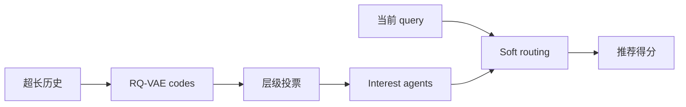
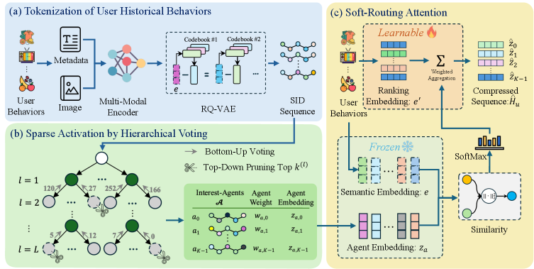

# HiSAC：层级稀疏激活压缩超长序列

> **Fidelity: 核心机制复现**。执行 residual codes、层级投票、兴趣 agent 与 soft routing。

## 论文信息

| 项目 | 内容 |
| --- | --- |
| 论文链接 | [arXiv 2602.21009](https://arxiv.org/abs/2602.21009) |
| 公司/机构 | Alibaba / Taobao |
| 首次公开日期 | 2026-02-24（arXiv v1） |
| 原文开源代码 | 否：论文未提供官方/作者代码（核查日期：2026-08-09） |
| Adapter | `hisac` |
| 本地复现代码 | [`src/auto_research/reproductions/hisac/`](https://github.com/daiwk/auto-research/tree/main/src/auto_research/reproductions/hisac/) |

## 原始论文总结

### 背景与主要改动

超长行为全量 attention 成本高，固定压缩又损失长尾兴趣。HiSAC 用多模态 RQ-VAE 形成层级 code，逐层投票生成用户特定 interest agents，再让当前 query 只 soft-route 到少量相关 agent。



<!-- paper-figure:start -->
### 原论文关键图

[](https://arxiv.org/html/2602.21009v2/x1.png)

> **原论文 Figure 1（关键图）**：展示原论文方法的总体设计和关键组成。图片来自[原论文](https://arxiv.org/abs/2602.21009)，版权归原作者所有；点击图片可查看来源。
<!-- paper-figure:end -->

### 核心公式

$$
a_k=\frac{\sum_{i:c_i=k}w_i e_i}{\sum_{i:c_i=k}w_i},
\qquad
h=\sum_{k\in\mathcal A(q)}\operatorname{softmax}(q^\top a_k)a_k.
$$

### 论文离线与线上效果

淘宝生产 A/B 的 CTR `+1.65%`，同时降低延迟与内存。

## 本地复现

> **本地对照口径**：基线是 recent-window dense proxy；实验组使用三层 codes、hierarchical voting 和 soft routing，NDCG@10 `0.03540→0.03586`，相对 **+1.31%**，Hit@10 相对 `-4.35%`。

结果见 [`metrics/movielens-seed42.json`](metrics/movielens-seed42.json)。

```bash
auto-research reproduce --paper hisac --dataset-dir data --seed 42
```

## 复现边界

本地最多 64 行为，未复刻淘宝多模态 embedding、超长日志、稀疏 kernel 和线上服务。
