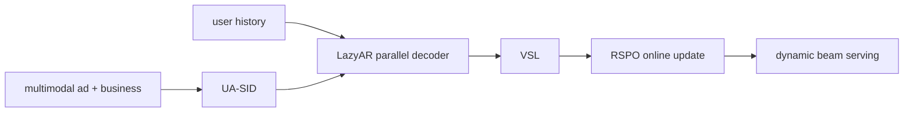

# GR4AD：面向大规模广告的生成式推荐

> **Fidelity: 核心机制复现**。UA-SID、并行 LazyAR、VSL、list-wise RSPO 均训练；私有多模态广告、eCPM、在线持续学习和动态 beam 服务未复刻。

## 原始论文总结
### 背景与主要改动
广告生成式推荐同时受商业语义、实时更新和延迟约束。GR4AD 用多粒度 UA-SID 编码广告，LazyAR 放松层间自回归依赖，VSL 按商业价值加权监督，RSPO 直接优化列表排序，Dynamic Beam Serving 随负载调整 beam。

### 核心公式
$L_{VSL}=-w(v_i)\sum_l\log p(c_{i,l}|h)$；本地 RSPO 以价值奖励分布 $q_j\propto e^{r_j/\tau}$ 优化 $L_{RSPO}=-\sum_jq_j\log p_\theta(j|h)$。
### 论文离线与线上效果
LazyAR 近乎翻倍 QPS，离峰 beam 可增加 60%；相对 DLRM 广告收入最高 **+4.2%**，已覆盖 4 亿+用户。

## 本地复现

> **本地对照口径**：统一跨模型基线是 DIN，GR4AD NDCG@10 相对 DIN **+69.67%**；内部 DLRM 基线加入 UA-SID/LazyAR/VSL/RSPO 后 **+49.88%**。两项都伴随 head share 0.505 的偏置风险。
60 steps、180 users/280 items、seeds 42–44。统一 DIN（100 steps）Hit/NDCG 为 0.0481/0.02167；GR4AD 为 0.0704/0.03676，NDCG 相对 DIN **+69.67%**。相对内部 DLRM 消融为 **+49.88%**；但 head share 达 0.505，MovieLens popularity 价值代理导致明显集中。指标见 [`metrics/movielens-100k-seeds42-44.json`](metrics/movielens-100k-seeds42-44.json)。
