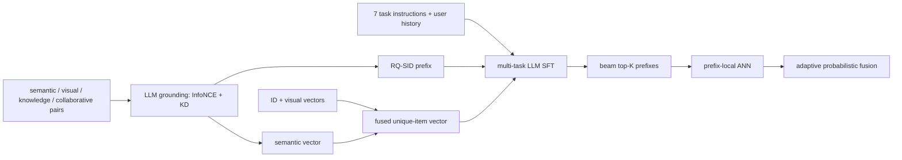

# SIGMA：语义 grounding 的指令式多任务生成推荐

> **Fidelity: 完整核心链路**。本地实际执行 causal-LM LoRA 多视角 InfoNCE+KD、RQ-SID prefix 与 unique ID 混合 token、七类 instruction SFT、SID-prefix NTP、同-prefix hard-negative InfoNCE、prefix beam→子目录 item retrieval→APF。不是用最终分数规则模拟 SIGMA。

- 论文：[arXiv 2602.22913](https://arxiv.org/abs/2602.22913)，Alibaba / AliExpress，2026-02
- Adapter：`sigma`；代码：`src/auto_research/reproductions/sigma/`
- 本地数据：MiniOneRec Amazon Office，使用官方 RQ-SID、Qwen item embedding、标题和行为序列

## 原始论文总结

### 背景与主要改动

普通生成推荐只做 next-item，难以即时响应 Query、Category、Longtail、Discover、Season、Holiday 等业务任务。SIGMA 先通过搜索语义、视觉、世界知识和协同行为四类 relevance pair，把 LLM 语义与在线 ID embedding 对齐；随后用“短 SID prefix + unique item ID”同时保留生成效率和商品精度；七任务 instruction SFT 统一训练；推理时先 beam 生成 prefix，再只在对应子目录 ANN，并用 APF 根据 prefix 置信度差异自动调节精确性/多样性。



### 核心公式

多视角 relevance pair 使用 in-batch InfoNCE，并用在线 ID embedding 的相似度分布做 KD：

$$
\mathcal L_{CL}=-\frac1{2B}\sum_i\log P_{text}(i'\mid i),
$$

$$
\mathcal L_{KD}=\sum_{i,j}P_{ID}(j\mid i)\log\frac{P_{ID}(j\mid i)}{P_{text}(j\mid i)}.
$$

混合 token 为 $[c_1,\dots,c_\ell,id_i]$；SFT 联合优化 prefix NTP 与同 prefix hard negatives 的 item InfoNCE：

$$
\mathcal L_{NTP}=-\frac1\ell\sum_t\log P(c_t\mid U,H,I,c_{<t}),
$$

$$
\mathcal L_{ID}=-\log\frac{e^{\cos(h,\tilde v_i)/\tau}}{e^{\cos(h,\tilde v_i)/\tau}+\sum_{j\in N_c}e^{\cos(h,\tilde v_j)/\tau}}.
$$

APF 将 prefix beam score $\phi_k$ 与 prefix 内 item probability 相乘，并用 top-K prefix score 标准差调温：

$$
P(v_i\mid T)=P(c^k\mid T)P(id_i\mid T,c^k),
$$

$$
P(id_i\mid T,c^k)\propto\exp(\cos(h_k,\tilde v_i)\,\sigma(\phi_1,\dots,\phi_K)/\tau).
$$

### 论文离线与线上效果

| Paper variant | HR@1 | HR@5 | HR@10 | HR@20 |
|---|---:|---:|---:|---:|
| GR (SID) | 8.01% | 16.17% | 22.41% | 26.41% |
| GR (ID) | 7.31% | 20.15% | 28.98% | 37.37% |
| SIGMA SID1ID→SID1ID | **9.61%** | **24.73%** | **33.76%** | **43.05%** |
| - semantic grounding | 7.80% | 19.10% | 25.85% | 33.24% |
| - APF | 9.31% | 22.82% | 30.18% | 37.73% |

AliExpress 四类任务 5% 流量、两周 A/B：Order `+2.80%`、CVR `+3.84%`、GMV `+7.84%`、购买品类宽度 `+2.47%`。

## 本地复现

> **本地对照口径**：基线是同一 grounded SmolLM、相同七任务 SFT 与 fused item vectors 下的 `id_only` item head；实验组使用论文 hybrid prefix→ID 三步生成。validation 选择 `top1_prefix`；held-out test HR@20 从 0.0078125（1/128）到 0.0703125（9/128），相对 **+800.00%**，NDCG@10 从 0.003906 到 0.034112（**+773.27%**）。绝对命中仍只有 9 个，不能把相对数解读为工业量级提升。

使用 12,000 train、128 validation、128 test 用户和完整 3,459 商品目录；40-step multi-view grounding，480-step 七任务 SFT。test 不参与三种推理模式选择。

| Local inference | HR@1 | HR@5 | HR@10 | HR@20 | NDCG@10 |
|---|---:|---:|---:|---:|---:|
| id_only（基线） | 0.00000 | 0.00781 | 0.00781 | 0.00781 | 0.00391 |
| top1_prefix（validation 选中） | **0.01562** | **0.03125** | **0.06250** | **0.07031** | **0.03411** |
| APF top5 prefixes | **0.01562** | **0.03125** | 0.05469 | 0.06250 | 0.03145 |

hybrid prefix 明显缩小了 item 搜索空间；但 APF 相对 top1-prefix 的 HR@20 下降 11.11%，本地没有复现论文 APF 增益。七任务分桶样本只有约 18/任务，逐任务数字只作诊断，不作结论。

```bash
AUTO_RESEARCH_SIGMA_GROUNDING_STEPS=40 \
AUTO_RESEARCH_SIGMA_SFT_STEPS=480 \
AUTO_RESEARCH_SIGMA_EVAL_USERS=128 \
auto-research reproduce --paper sigma --seed 42
```

稳定指标见 [`metrics/office-seed42.json`](metrics/office-seed42.json)。约 3–4 分钟的 MPS 训练不保存 checkpoint 到 Git。

## 复现边界

- 使用真实 SmolLM LoRA 编码与反向，不是固定 embedding 直接代替 multi-view grounding；商品侧使用论文公开基准已有的 Qwen/RQ-SID 文件。
- AliExpress 150M grounding pairs + 130M SFT + 2M eval 缩为 Office；query、季节、节日、视觉和知识 view 使用公开标题/embedding 的确定性任务映射。
- ANN 在 3,459 商品上用精确 cosine top-k 实现，等价验证检索逻辑但不测大规模 ANN 延迟。
- 当前结果支持 hybrid token 搜索空间机制，不支持 APF 或线上业务收益结论。
