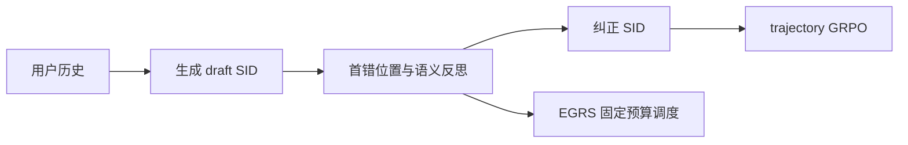

# GRC：生成、反思与纠错的生成式推荐轨迹

> **Fidelity: 核心机制复现**。结构化 SFT、完整轨迹 GRPO 与 entropy-guided reflection scheduling 均实际执行。

## 论文信息

| 项目 | 内容 |
| --- | --- |
| 论文链接 | [arXiv 2602.23639](https://arxiv.org/abs/2602.23639) |
| 公司/机构 | Alibaba International / Wuhan University |
| 首次公开日期 | 2026-02-27（arXiv v1） |
| 原文开源代码 | 否：未找到作者公开代码（核查日期：2026-07-16） |
| Adapter | `grc` |
| 本地复现代码 | [`src/auto_research/reproductions/grc/`](https://github.com/daiwk/auto-research/tree/main/src/auto_research/reproductions/grc/) |

## 原始论文总结

### 背景与主要改动

Semantic ID 自回归生成的早期错误会向后传播。GRC 把 draft SID、首错位置/属性一致性反思、corrected SID 串成结构化模板；再对完整轨迹做 GRPO，并用反思 token 熵把固定纠错预算分配给最不确定的 beam。



### 核心公式

$$
r_{loc}=\min\big(\{t:\hat z_t\ne z_t^{gt}\}\cup\{L+1\}\big),\qquad \mathcal L_{SFT}=\mathcal L_{MLE}+\lambda_{rc}\mathcal L_{rc}.
$$

$$
\operatorname{score}_{EGRS}=\operatorname{score}_{base}+\alpha_e\bar H^{ref}.
$$

### 论文离线与线上效果

2026-01-02 至 01-12、control/treatment 各 15%：Revenue `+1.79%`、CTR `+2.11%`、GMV `+2.04%`，均显著。

## 本地复现

> **本地对照口径**：基线是同一 SID 的 GR backbone；实验组 GRC 加入 1,320 条结构化轨迹、10 轮 GRPO 与 EGRS，相对基线 Hit@10 **`-12.50%`**、NDCG@10 **`-11.12%`**。

GRPO 平均 reward `8.3989→8.4273`，但 test 全库排序退化。稳定指标见 [`metrics/movielens-100k-seed42.json`](metrics/movielens-100k-seed42.json)。

```bash
auto-research reproduce --paper grc --seed 42
```

## 复现边界

MovieLens genre 代理 category/seller/brand 属性；未复刻工业 LLM 参数量。
