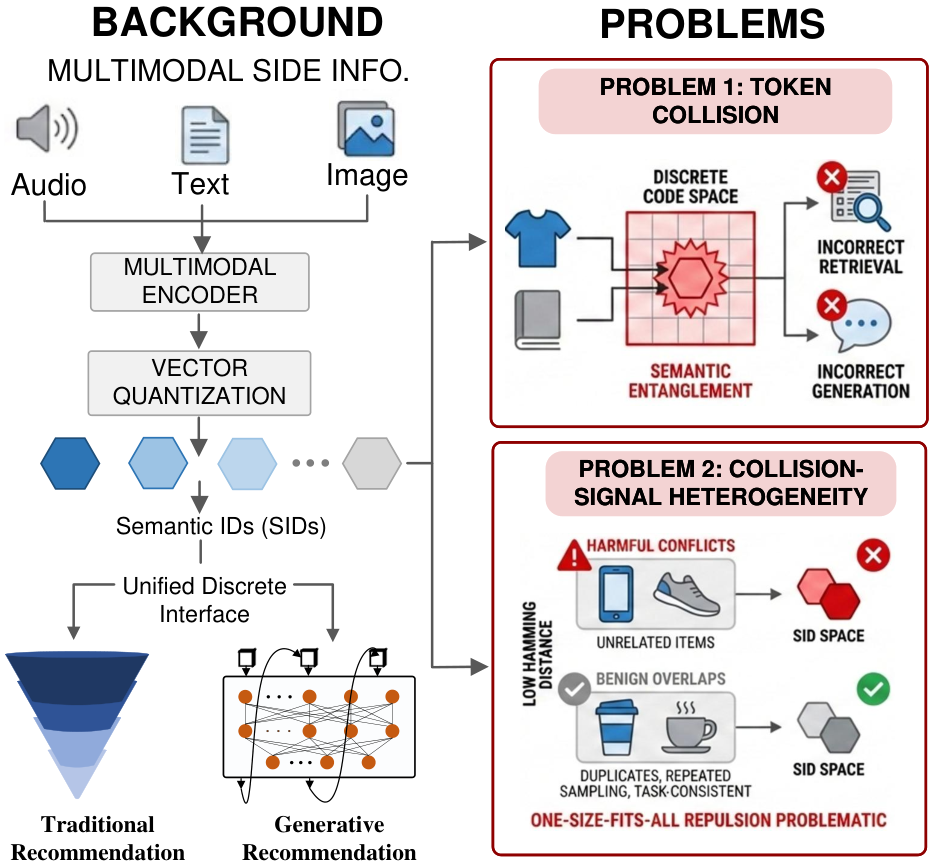

# Stop Treating Collisions Equally: Qualification-Aware Semantic ID Learning for Recommendation at Industrial Scale

> **保真度：核心机制复现**。原文线上结论、本地公开数据实验和未复刻部分分开陈述。

## 论文信息

| 项目 | 内容 |
| --- | --- |
| 论文链接 | [arXiv 2603.00632](https://arxiv.org/abs/2603.00632) |
| 公司/机构 | University of Electronic Science and Technology of China / Kuaishou |
| 首次公开日期 | 2026-02-28（arXiv v1） |
| 原文开源代码 | 否：原文未提供官方/作者代码（核查日期：2026-08-24） |
| Adapter | `quasid` |
| 本地复现代码 | [`src/auto_research/reproductions/quasid/`](https://github.com/daiwk/auto-research/tree/main/src/auto_research/reproductions/quasid/) |

## 原始论文总结

### 背景与主要改动

用业务资格信号决定碰撞对的 margin，而不是统一排斥；反馈稀疏或冷启动 item 得到更强的可辨识 SID。


<!-- paper-figure:start -->
### 原论文关键图

[](https://arxiv.org/html/2603.00632v1/illustration_v4.png)

> **原论文 Figure 1（关键图）**：展示原论文方法的总体设计和关键组成。图片来自[原论文](https://arxiv.org/abs/2603.00632)，版权归原作者所有；点击图片可查看来源。
<!-- paper-figure:end -->

### 核心公式

$$
L_{qual}=\sum_{ij}q_{ij}[m_{ij}-d(z_i,z_j)]_+
$$

### 论文离线与线上效果

原文线上证据：**GMV-S2 +2.38%**（5% traffic, five days，Section 5.4）。论文私有口径不能与下方 MovieLens 指标直接比较。

## 本地复现

> **本地对照口径**：基线为共享 transition + content scorer；实验组在同一用户、物品、全库候选和 seed 上只加入 `quasid` 核心机制，相对 NDCG@10 -0.55%。

MovieLens-100K、220 users / 360 items、seed 42：NDCG@10 0.0540 → **0.0537（-0.55%）**，Hit@10 0.1091 → 0.0909。验证集只选择混合权重，测试集未参与调参。

```bash
auto-research reproduce --paper quasid --dataset-dir data --seed 42
```

固定指标见 [`metrics/public-seed42.json`](metrics/public-seed42.json)。

## 复现边界

在 MovieLens-100K 固定全库候选、相同切分和 seed 上执行论文核心机制；私有特征、生产基础模型和在线流量不可公开，论文 A/B 数字只作原文引用。 本地实现拥有独立模型状态和打分路径；负结果同样保留，且本地相对变化不得与原文 A/B 提升混写。
