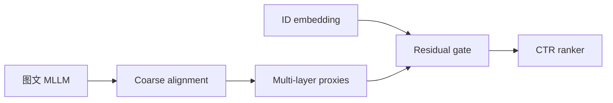
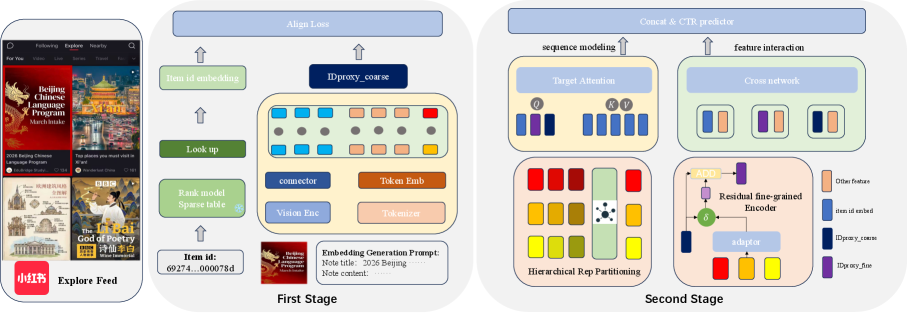

# IDProxy：将多模态 LLM 表征对齐到物品 ID 空间

> **复现保真度：核心机制复现。** 粗对齐、多层 proxy adapter 和残差门控实际执行；InternVL 与私有图文未复刻。

## 论文信息

| 项目 | 内容 |
| --- | --- |
| 论文链接 | [arXiv 2603.01590](https://arxiv.org/abs/2603.01590) |
| 公司/机构 | Xiaohongshu / Shanghai Jiao Tong University / Fudan University |
| 首次公开日期 | 2026-03-02（arXiv v1） |
| 原文开源代码 | 否：论文未提供官方/作者代码（核查日期：2026-08-09） |
| Adapter | `idproxy` |
| 本地复现代码 | [`src/auto_research/reproductions/idproxy/`](https://github.com/daiwk/auto-research/tree/main/src/auto_research/reproductions/idproxy/) |

## 原始论文总结

### 背景与主要改动

多模态 LLM 的语义空间与 CTR 模型长期学习的 item-ID 协同空间并不一致。IDProxy 先用粗粒度对比目标对齐两者，再从多层 hidden state 生成 proxy，通过 residual gate 注入工业排序网络。



<!-- paper-figure:start -->
### 原论文关键图

[](https://arxiv.org/html/2603.01590v1/x3.png)

> **原论文 Figure 2（关键图）**：展示原论文提出的核心架构、主要模块及其连接关系。图片来自[原论文](https://arxiv.org/abs/2603.01590)，版权归原作者所有；点击图片可查看来源。
<!-- paper-figure:end -->

### 核心公式

$$
\mathcal L_{\rm PAL}=-\log\frac{\exp(z_i^\top e_i/\tau)}
{\sum_j\exp(z_i^\top e_j/\tau)},\qquad
\tilde e_i=e_i+\sigma(g_i)\operatorname{Adapter}(z_i).
$$

### 论文离线与线上效果

内容流时长 +0.22%、阅读 +0.39%、互动 +0.50%；广告 impression +1.28%、ADVV +1.93%、COST +1.73%。

## 本地复现

MovieLens genre 作为公开内容模态，先投影到双向行为转移 ID 空间，再执行多层非线性 proxy 和 gate。

> **本地对照口径**：基线为 ID-only ranker，实验组为 coarse-to-fine IDProxy；40-step 对比损失 6.073→5.358，NDCG@10 0.03540→0.03728，相对 +5.32%，见 `metrics/movielens-100k-seed42.json`。

```bash
auto-research reproduce --paper idproxy --dataset-dir data --seed 42
```
