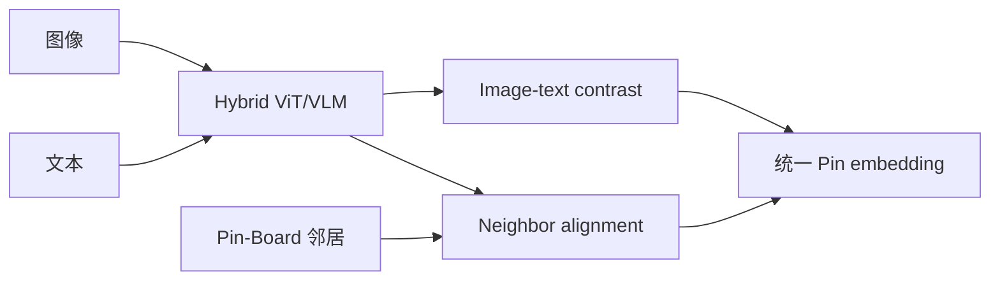

# PinCLIP：Pinterest 大规模多模态基础表征

> **Fidelity: 核心机制复现**。执行内容—图邻居对比对齐和 fresh cohort 评估；不训练视觉 backbone。

## 论文信息

| 项目 | 内容 |
| --- | --- |
| 论文链接 | [arXiv 2603.03544](https://arxiv.org/abs/2603.03544) |
| 公司/机构 | Pinterest |
| 首次公开日期 | 2026-03-03（arXiv v1） |
| 原文开源代码 | 否：论文未提供官方/作者代码（核查日期：2026-07-27） |
| Adapter | `pinclip` |
| 本地复现代码 | [`src/auto_research/reproductions/pinclip/`](https://github.com/daiwk/auto-research/tree/main/src/auto_research/reproductions/pinclip/) |

## 原始论文总结

### 背景与主要改动

通用 VLM 的训练目标与推荐不一致，且新内容缺少行为。PinCLIP 以 VLM 为 backbone，混合多粒度图文特征，并加入 Pin-Board 图邻居对齐目标，让表征同时掌握内容和推荐图语义。



### 核心公式

$$
\mathcal L=\mathcal L_{\mathrm{image\text{-}text}}
+\lambda\mathcal L_{\mathrm{neighbor}},\qquad
\mathcal L_{\mathrm{neighbor}}
=-\log\frac{e^{z_i^\top z_j/\tau}}{\sum_k e^{z_i^\top z_k/\tau}}.
$$

### 论文离线与线上效果

多模态 retrieval 相对 Qwen `+20%`；fresh organic Repin `+15%`，new Ads click `+8.7%`。

## 本地复现

> **本地对照口径**：基线是 raw genre/content similarity；实验组学习内容—共现图 canonical alignment，NDCG@10 `0.03540→0.03490`，相对 **-1.41%**，未复现论文增益。

负结果说明稀疏 genre 不能替代图像/文本 VLM。见 [`metrics/movielens-seed42.json`](metrics/movielens-seed42.json)。

```bash
auto-research reproduce --paper pinclip --dataset-dir data --seed 42
```

## 复现边界

无图像像素、VLM 预训练和 Pinterest 全图；只验证 neighbor alignment 路径，不能据此否定原论文。
