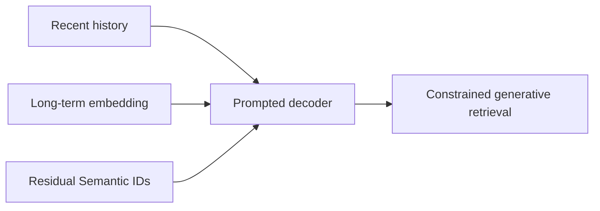
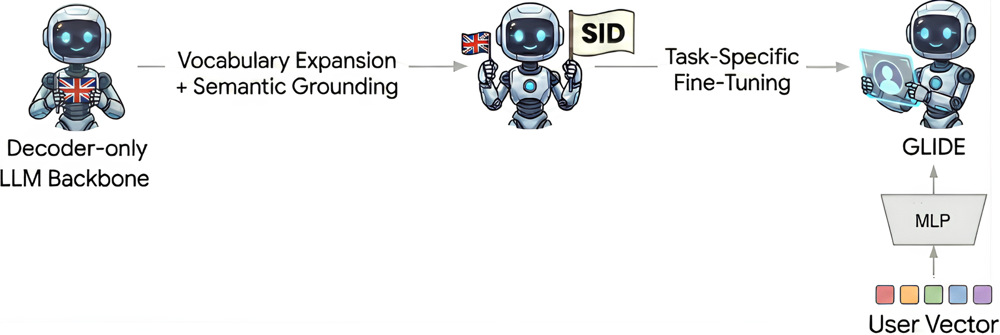

# GLIDE：融合长短期兴趣的生成式检索

> **复现保真度：核心机制复现。** Residual Semantic ID、code 生成和双时间尺度 prompt 均实际执行。

## 论文信息

| 项目 | 内容 |
| --- | --- |
| 论文链接 | [arXiv 2603.17540](https://arxiv.org/abs/2603.17540) |
| 公司/机构 | Spotify |
| 首次公开日期 | 2026-03-18（arXiv v1） |
| 原文开源代码 | 否：论文未提供官方/作者代码（核查日期：2026-07-28） |
| Adapter | `glide` |
| 本地复现代码 | [`src/auto_research/reproductions/glide/`](https://github.com/daiwk/auto-research/tree/main/src/auto_research/reproductions/glide/) |

## 原始论文总结

### 背景与主要改动

纯近期序列容易只召回习惯内容。GLIDE 用 Semantic ID 自回归生成候选，同时把近期行为和长期用户 embedding 作为两类 prompt，兼顾即时意图与探索。



<!-- paper-figure:start -->
### 原论文关键图

[](https://arxiv.org/html/2603.17540v1/figures/final_steps_upscaled.png)

> **原论文 Figure 1（关键图）**：展示原论文的训练流程与关键优化环节。图片来自[原论文](https://arxiv.org/abs/2603.17540)，版权归原作者所有；点击图片可查看来源。
<!-- paper-figure:end -->

### 核心公式

$$
p(c_{1:L}\mid h_{\rm recent},u_{\rm long})
=\prod_{\ell=1}^L p(c_\ell\mid c_{<\ell},h_{\rm recent},u_{\rm long}).
$$

### 论文离线与线上效果

Spotify 线上 non-habitual streaming +5.4%，new-show discovery +14.3%。

## 本地复现

公开 item feature 做三级 residual quantization，以 code transition 生成并融合短期历史/长期内容画像。

> **本地对照口径**：基线为传统 transition/content retrieval，实验组为 Semantic-ID 双 prompt 检索；NDCG@10 0.03540→0.03437，相对 -2.89%，见 `metrics/movielens-100k-seed42.json`。

```bash
auto-research reproduce --paper glide --dataset-dir data --seed 42
```
