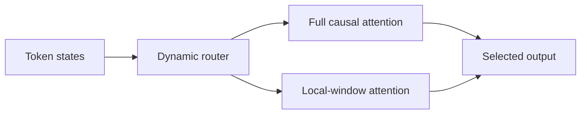
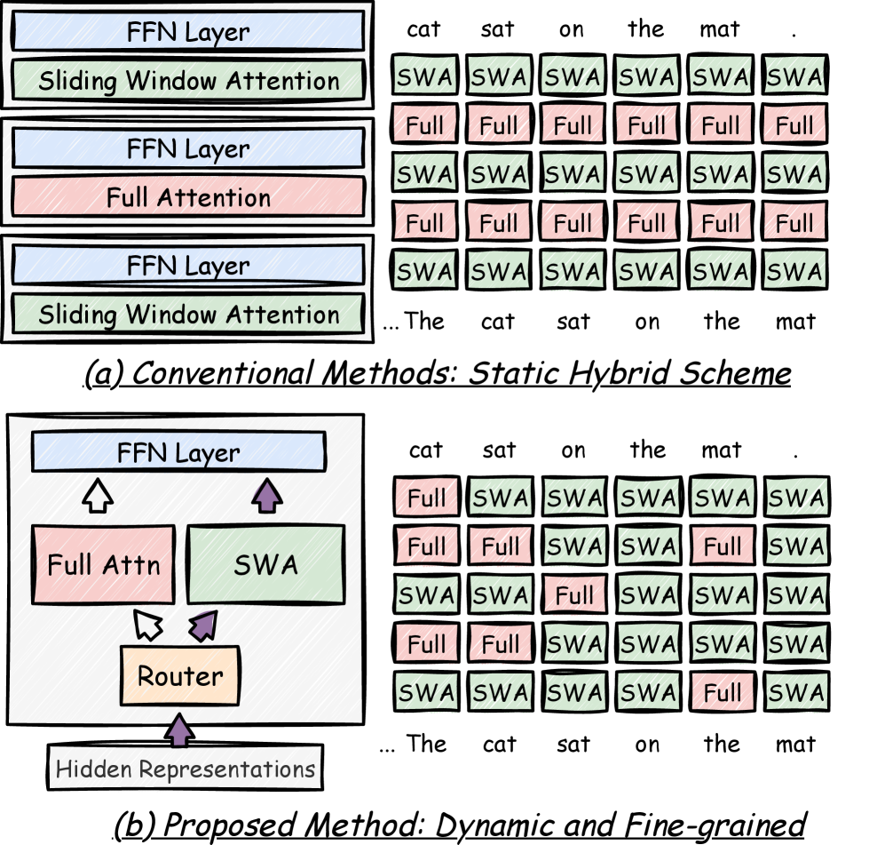

# Switch Attention

> **Fidelity: 核心机制复现**。实现逐 token 动态选择 full/local attention 的可学习 router。

## 论文信息

| 项目 | 内容 |
| --- | --- |
| 论文链接 | [arXiv 2603.26380](https://arxiv.org/abs/2603.26380) |
| 公司/机构 | Peking University / Huawei Technologies |
| 首次公开日期 | 2026-03-27（arXiv v1） |
| 原文开源代码 | 否：论文未提供官方/作者代码（核查日期：2026-08-09） |
| Adapter | `switch-attention` |
| 本地复现代码 | [`src/auto_research/reproductions/switch_attention/`](https://github.com/daiwk/auto-research/tree/main/src/auto_research/reproductions/switch_attention/) |

## 原始论文总结

### 背景与主要改动

静态 hybrid attention 对所有 token 使用固定模式。Switch Attention 学习细粒度 router，只让需要全局信息的 token 走 full attention。



<!-- paper-figure:start -->
### 原论文关键图

[](https://arxiv.org/html/2603.26380v2/x1.png)

> **原论文 Figure 1（关键图）**：展示原论文方法的总体设计和关键组成。图片来自[原论文](https://arxiv.org/abs/2603.26380)，版权归原作者所有；点击图片可查看来源。
<!-- paper-figure:end -->

### 核心公式

$$
g_t=\operatorname{STE}(\sigma(w^\top x_t)),\qquad
y_t=g_tA_{\rm full}(x)_t+(1-g_t)A_{\rm local}(x)_t.
$$

### 论文离线与线上效果

论文报告检索较 SWA-CPT 提升 **27.5%**、长上下文较静态 hybrid 提升 **6.3%**，32K decoding 超过 **4×** 加速，平均 full-attention 比例约 **0.13**；无线上 A/B。

## 本地复现

> **本地对照口径**：基线是 full-attention tiny Transformer；实验组动态混合 full 与 16-token local attention；30-step perplexity 相对 **+0.19%**（近似持平但略差）。

```bash
auto-research reproduce --paper switch-attention
```

结构化结果见 [`metrics/wikitext2-seed42.json`](metrics/wikitext2-seed42.json)。

## 复现边界

本地使用可微 soft router，未复刻论文 STE 硬路由、32K continual pretraining 和 branch-selective fused kernel。
