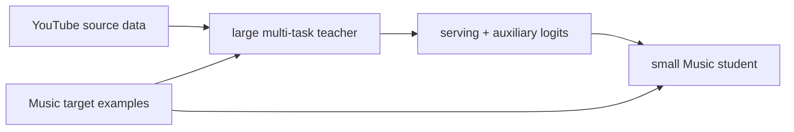

# Zero-shot Cross-domain KD：YouTube 到 YouTube Music

> **Fidelity: 核心机制复现**。源域大 teacher、目标域小 student、目标样本上的 zero-shot logits 和 non-serving auxiliary-task distillation 均执行；私有跨产品 schema 未复刻。

## 原始论文总结
### 背景与主要改动
低流量产品无力训练大型专用 teacher。论文直接把数据丰富的 YouTube 多任务 teacher 应用于 YouTube Music 样本，把 serving task 与辅助 task logits 蒸馏到小模型，不要求源域数据或匹配的界面特征。

### 核心公式
$L=L_{target}+\lambda T^2KL(softmax(z_T/T)\Vert softmax(z_S/T))+\gamma\|a_T-a_S\|^2$。
### 论文离线与线上效果
CTR AUC 79.34→79.55，trail engagement 0.312→0.320；线上 discovery **+1.12%**、new releases engagement **+11.39%**。

## 本地复现
180 source users、60 target users，teacher 19,091 参数、student 7,171 参数。KD 权重从 0.35 调到 0.2、100 steps；Hit@10 均为 0.0444，NDCG 0.01690→0.01741（**+3.02%**）。指标见 [`metrics/movielens-100k-seeds42-44.json`](metrics/movielens-100k-seeds42-44.json)。

