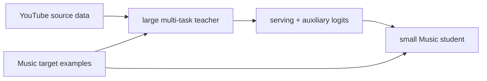

# Zero-shot Cross-domain KD：YouTube 到 YouTube Music

> **Fidelity: 核心机制复现**。源域大 teacher、目标域小 student、目标样本上的 zero-shot logits 和 non-serving auxiliary-task distillation 均执行；私有跨产品 schema 未复刻。

## 论文信息

| 项目 | 内容 |
| --- | --- |
| 论文链接 | [arXiv 2603.28994](https://arxiv.org/abs/2603.28994) |
| 公司/机构 | Google / YouTube |
| 首次公开日期 | 2026-03-30（arXiv v1） |
| 原文开源代码 | 否：论文未提供官方/作者代码（核查日期：2026-07-15） |
| Adapter | `cross-domain-kd` |
| 本地复现代码 | [`src/auto_research/reproductions/cross_domain_kd/`](https://github.com/daiwk/auto-research/tree/main/src/auto_research/reproductions/cross_domain_kd/) |

## 原始论文总结
### 背景与主要改动
低流量产品无力训练大型专用 teacher。论文直接把数据丰富的 YouTube 多任务 teacher 应用于 YouTube Music 样本，把 serving task 与辅助 task logits 蒸馏到小模型，不要求源域数据或匹配的界面特征。

### 核心公式
$L=L_{target}+\lambda T^2KL(softmax(z_T/T)\Vert softmax(z_S/T))+\gamma\|a_T-a_S\|^2$。
### 论文离线与线上效果
CTR AUC 79.34→79.55，trail engagement 0.312→0.320；线上 discovery **+1.12%**、new releases engagement **+11.39%**。

## 本地复现

> **本地对照口径**：跨模型基线是在相同 target split 上训练的 DIN，实验组 KD student 的 NDCG@10 相对 DIN **-68.46%**；内部基线 target-only student 加蒸馏后 **+3.02%**。后者只说明 KD 对弱 student 的增量，不能表述成优于 DIN。
180 source users、60 target users，teacher 19,091 参数、student 7,171 参数。DIN 与 KD 在完全相同 target split 上评估：DIN Hit/NDCG 0.1056/0.05518，KD student 0.0444/0.01741，NDCG 相对 DIN **-68.46%**。KD 相对 target-only student 仍为 **+3.02%**，但远弱于 DIN 且 DIN head share 更高。指标见 [`metrics/movielens-100k-seeds42-44.json`](metrics/movielens-100k-seeds42-44.json)。
