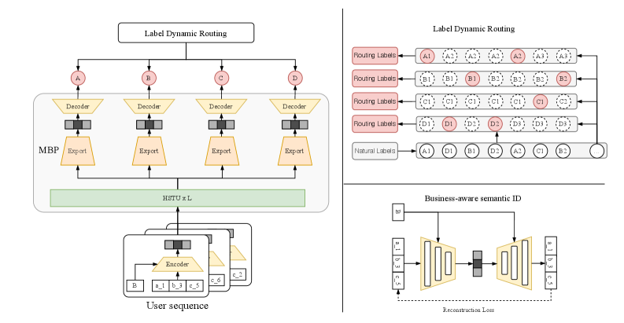

# MBGR：多业务生成式推荐

> **Fidelity: 核心机制复现**。Business-aware SID、共享 experts、逐业务预测与 Label Dynamic Routing 均实际执行。

## 论文信息

| 项目 | 内容 |
| --- | --- |
| 论文链接 | [arXiv 2604.02684](https://arxiv.org/abs/2604.02684) |
| 公司/机构 | Meituan |
| 首次公开日期 | 2026-04-03（arXiv v1） |
| 原文开源代码 | 否：论文未提供官方/作者代码（核查日期：2026-07-28） |
| Adapter | `mbgr` |
| 本地复现代码 | [`src/auto_research/reproductions/mbgr/`](https://github.com/daiwk/auto-research/tree/main/src/auto_research/reproductions/mbgr/) |

## 原始论文总结

### 背景与主要改动

多业务日志交错时，普通 next-item 监督只覆盖实际下一条业务。MBGR 用 business-conditioned autoencoder 保留 SID 语义，以共享 MoE 生成业务特定表示；LDR 在每个时刻为每个业务寻找最近未来交互，无标签业务被 mask。


<!-- paper-figure:start -->
### 原论文关键图

[](https://arxiv.org/html/2604.02684v1/x1.png)

> **原论文 Figure 1（关键图）**：展示原论文提出的核心架构、主要模块及其连接关系。图片来自[原论文](https://arxiv.org/abs/2604.02684)，版权归原作者所有；点击图片可查看来源。
<!-- paper-figure:end -->

### 核心公式

$$
e^b=\sum_{k=1}^K g_k^b\operatorname{FFN}^{exp}_k([e,b]),\qquad i_{u,t+1}^{(k)}=i_{u,t'},\ t'=\min\{t''>t:b_{u,t''}=b_k\}.
$$

### 论文离线与线上效果

Meituan 线上 A/B 的 CTCVR 提升 `+3.98%`。

## 本地复现

> **本地对照口径**：基线是共享 next-item 模型；实验组 MBGR 用 genre 作为 19 个业务域并执行 BID/MBP/LDR，相对基线 Hit@10 **`-4.17%`**、NDCG@10 **`-5.92%`**。

验证集选择 blend `0.1`；LDR 共 mask `140,235` 个无效业务标签。稳定指标见 [`metrics/movielens-100k-seed42.json`](metrics/movielens-100k-seed42.json)。

```bash
auto-research reproduce --paper mbgr --seed 42
```

## 复现边界

genre 是公开业务域代理，不能替代 Meituan 多业务私有日志与线上生成器规模。
