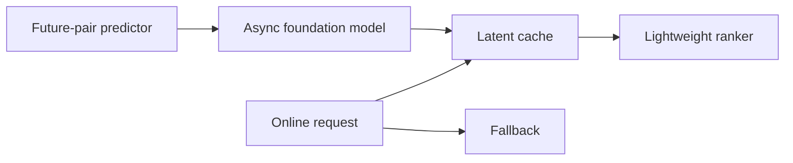
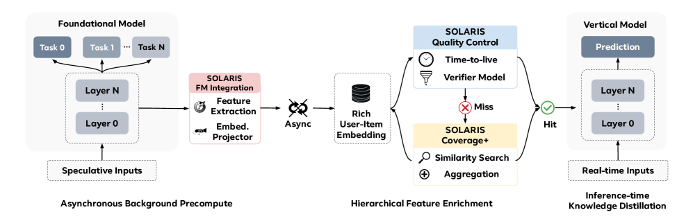

# SOLARIS：用预测式 Latent Cache 服务推荐 Foundation Model

> **复现保真度：核心机制复现。** Future-pair predictor、异步 cache 与 fallback 均实际执行。

## 论文信息

| 项目 | 内容 |
| --- | --- |
| 论文链接 | [arXiv 2604.12110](https://arxiv.org/abs/2604.12110) |
| 公司/机构 | Meta |
| 首次公开日期 | 2026-04-13（arXiv v1） |
| 原文开源代码 | 否：论文未提供官方/作者代码（核查日期：2026-08-09） |
| Adapter | `solaris` |
| 本地复现代码 | [`src/auto_research/reproductions/solaris/`](https://github.com/daiwk/auto-research/tree/main/src/auto_research/reproductions/solaris/) |

## 原始论文总结

### 背景与主要改动

大推荐模型在请求时为全部 user-item 对计算 latent 不现实。SOLARIS 先预测未来会访问的 pair，异步用 foundation model 预计算并缓存 latent；请求命中 cache 直接消费，未命中走 fallback。



<!-- paper-figure:start -->
### 原论文关键图

[](https://arxiv.org/html/2604.12110v2/x1.png)

> **原论文 Figure 1（关键图）**：展示原论文方法的总体设计和关键组成。图片来自[原论文](https://arxiv.org/abs/2604.12110)，版权归原作者所有；点击图片可查看来源。
<!-- paper-figure:end -->

### 核心公式

$$
\mathcal C_t=\{(u,i):p_\phi(i\mid u,t+\Delta)>\tau\},\qquad
s(u,i)=f(e_u,e_i,z_{u,i}^{\rm cache}).
$$

### 论文离线与线上效果

论文报告已全流量部署，top-line revenue +0.67%。

## 本地复现

用未来三步交互训练 pair predictor，只缓存高置信 pair，并测量 cache 覆盖与 fallback 路径。

> **本地对照口径**：基线为 request-time ranker，实验组为 predictive latent cache；NDCG@10 0.03540→0.09118，相对 +157.58%，见 `metrics/movielens-100k-seed42.json`。

```bash
auto-research reproduce --paper solaris --dataset-dir data --seed 42
```
