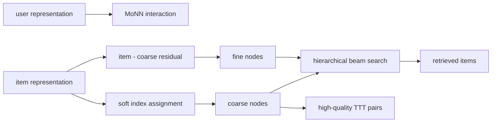
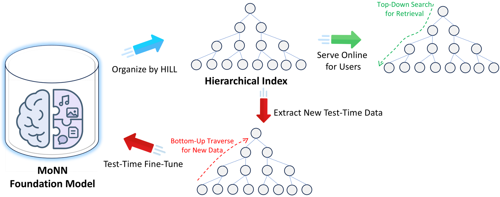

# HILL：为基础召回模型联合学习层级索引

> **Fidelity: 核心机制复现**。本地执行 soft assignment、跨层 residual quantization、层级 beam retrieval 与固定公开切分评测；不是把离线 k-means 树直接命名为 HILL。

## 论文信息

| 项目 | 内容 |
| --- | --- |
| 论文链接 | [EDBT 2026 / arXiv 2604.12965](https://arxiv.org/abs/2604.12965) |
| 公司/机构 | Meta |
| 首次公开日期 | 2026-04-14（arXiv v1） |
| 原文开源代码 | 否：论文未发布 HILL/MoNN 官方实现；只链接 Gowalla、Yelp 2018、Amazon-Book 的第三方数据仓库（核查日期：2026-09-01） |
| Adapter | `hill-index` |
| 本地复现代码 | [`src/auto_research/reproductions/hill_index/`](https://github.com/daiwk/auto-research/tree/main/src/auto_research/reproductions/hill_index/) |

## 原始论文总结

### 背景与主要改动

大型 retrieval foundation model 若对全部 user-item pair 执行复杂 interaction tower，线上成本不可接受。HILL 不再独立地按 item embedding 建 ANN，而是让 MoNN 的用户、item 与交互信号参与 index-node 学习；第一层用 attention-style soft assignment，下一层量化上一层未解释的 residual。线上沿树逐层缩小候选，高层节点还形成少量高质量样本用于 test-time training。



<!-- paper-figure:start -->
### 原论文关键图

[](https://arxiv.org/html/2604.12965v1/figures/framework.png)

> **原论文 Figure 1（关键图）**：展示原论文的整体流程、关键阶段及其数据流向。图片来自[原论文](https://arxiv.org/abs/2604.12965)，版权归原作者所有；点击图片可查看来源。
<!-- paper-figure:end -->

### 核心公式

item $v_j$ 与节点 $c_k$ 的距离和 soft assignment 为：

$$
d(j,k)=\lVert v_j-c_k\rVert_2^2,\qquad a_k=\frac{e^{-\alpha d(j,k)}}{\sum_{k'}e^{-\alpha d(j,k')}}.
$$

伪 item 表征 $\bar c=\sum_k a_kc_k$ 与用户共同进入 MoNN；下一层继续量化 $r_j=v_j-\bar c_j$，从而让各层保留互补信息。

### 论文离线与线上效果

- 论文在 Gowalla、Yelp 2018、Amazon-Book 以及 Meta 内部数据上比较 Recall@20/NDCG@20 和计算成本。
- Meta Ads production A/B 中，两层 `MoNN Medium → MoNN Small` 相对 MoNN Small 的 online ads metric 提升 `2.57%`；Small/Small 组合提升 `1.22%`。
- 服务覆盖 Facebook 与 Instagram 的日常广告推荐；公开论文没有释放生产模型或日志。

## 本地复现

> **本地对照口径**：基线为同一 item features、同一 query 和相近候选预算的一层 learned index，实验组加入 residual child layer 与层级 beam；seed 42 的候选占全目录约 `23.30%`，NDCG@10 相对基线 `-34.82%`。

不同 seed 的树结构差异较大，公开小 catalog 未重现论文质量收益，但确实执行并记录了 residual hierarchy 的候选压缩：

- [`metrics/public-seeds42-44.json`](metrics/public-seeds42-44.json)：三随机种子逐次结果、均值、标准差与 95% CI。

```bash
auto-research reproduce --paper hill-index --dataset-dir data --seed 42
```

## 复现边界

本地没有 MoNN 的千级特征、多任务半监督训练、Meta Ads 十亿级索引、FAISS EM 和真实 QPS；中间节点数量只作为公开的 TTT-data proxy，未宣称完成线上 test-time training。
