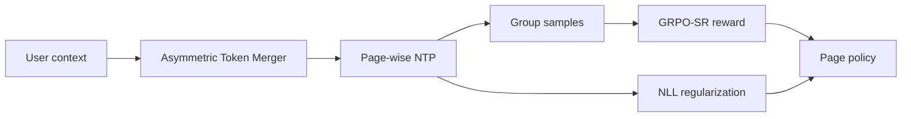

# GenRec：面向整页结果的生成式推荐

> **复现保真度：核心机制复现。** Page-wise NTP、非对称 Token Merger 与 GRPO-SR/NLL 约束实际执行。

## 论文信息

| 项目 | 内容 |
| --- | --- |
| 论文链接 | [arXiv 2604.14878](https://arxiv.org/abs/2604.14878) |
| 公司/机构 | JD.com |
| 首次公开日期 | 2026-04-16（arXiv v1） |
| 原文开源代码 | 否：论文未提供官方/作者代码（核查日期：2026-07-28） |
| Adapter | `genrec` |
| 本地复现代码 | [`src/auto_research/reproductions/genrec/`](https://github.com/daiwk/auto-research/tree/main/src/auto_research/reproductions/genrec/) |

## 原始论文总结

### 背景与主要改动

逐 item 生成忽略同一页面内的互补和顺序。GenRec 将下一页作为序列目标，用非对称 Token Merger 压缩输入，并以 GRPO-SR 的组内 reward 优化整页，同时保留 NLL 正则抑制策略漂移。



### 核心公式

$$
\mathcal L=\mathcal L_{\rm GRPO-SR}+\lambda\mathcal L_{\rm NLL},\qquad
A_i=R_i-\frac1G\sum_{j=1}^{G}R_j.
$$

### 论文离线与线上效果

京东线上 clicks +9.5%、transactions +8.7%。

## 本地复现

把连续三个正反馈组成一页，联合估计 page policy，并用序位 reward advantage 更新、NLL policy 约束。

> **本地对照口径**：基线为 point-wise ranker，实验组为 page-wise NTP + GRPO-SR；NDCG@10 0.03540→0.07621，相对 +115.30%，见 `metrics/movielens-100k-seed42.json`。

```bash
auto-research reproduce --paper genrec --dataset-dir data --seed 42
```
