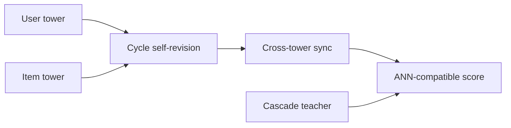

# CS3

> **Fidelity: 核心机制复现**。实现双塔间的循环自修正、显式交叉同步与级联教师辅助目标。

## 论文信息

| 项目 | 内容 |
| --- | --- |
| 论文链接 | [arXiv 2604.19269](https://arxiv.org/abs/2604.19269) |
| 公司/机构 | Kuaishou Technology |
| 首次公开日期 | 2026-04-21（arXiv v1） |
| 原文开源代码 | 是：[官方/作者代码](https://github.com/lixiangwang/CS3Rec) |
| Adapter | `cs3` |
| 本地复现代码 | [`src/auto_research/reproductions/cs3/`](https://github.com/daiwk/auto-research/tree/main/src/auto_research/reproductions/cs3/) |

## 原始论文总结

### 背景与主要改动

传统双塔为 ANN 解耦 user/item 表征，牺牲交叉能力。CS3 通过离线/在线可部署的循环修正和知识协同增强塔间交互。



### 核心公式

$$
u'=u+g_u(u,i)\odot\Delta_u,\quad i'=i+g_i(i,u)\odot\Delta_i,\quad
L=L_{\rm rank}+\lambda L_{\rm cascade}.
$$

### 论文离线与线上效果

快手三个生产场景的 Revenue 分别提升 **8.356% / 1.366% / 2.177%**。

## 本地复现

> **本地对照口径**：基线是 matched two-tower；实验组加入 cycle、cross sync 与 teacher loss；三 seed NDCG@10 相对 **-16.06%**，当前小数据未复现线上收益。

```bash
auto-research reproduce --paper cs3
```

结构化结果见 [`metrics/movielens-100k-seeds42-44.json`](metrics/movielens-100k-seeds42-44.json)。

## 复现边界

没有 4 亿 DAU 的在线缓存、EMA 跨塔向量和生产 QPS 链路。
