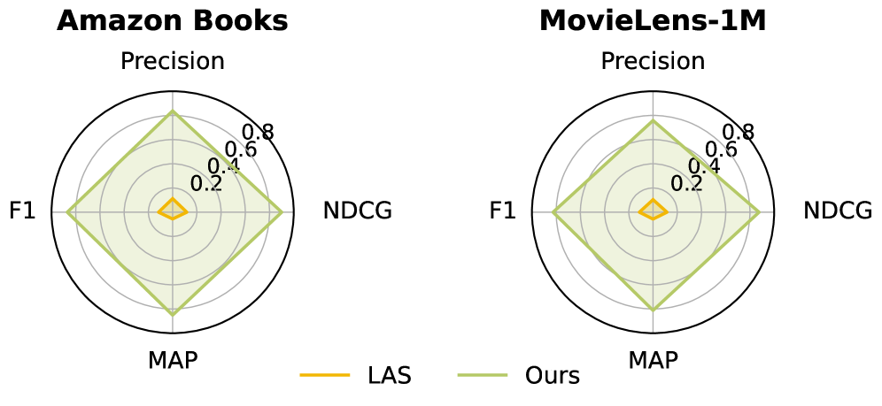

# From Local Indices to Global Identifiers: Generative Reranking via Global Action Space

> **保真度：核心机制复现**。原文结论、本地公开数据实验和未复刻部分分开陈述。

## 论文信息

| 项目 | 内容 |
| --- | --- |
| 论文链接 | [arXiv 2604.25291](https://arxiv.org/abs/2604.25291) |
| 公司/机构 | City University of Hong Kong / Kuaishou / UC San Diego |
| 首次公开日期 | 2026-04-28（arXiv v1） |
| 原文开源代码 | 否：论文未提供官方/作者代码（核查日期：2026-08-09） |
| Adapter | `glorank` |
| 本地复现代码 | [`src/auto_research/reproductions/glorank/`](https://github.com/daiwk/auto-research/tree/main/src/auto_research/reproductions/glorank/) |

## 原始论文总结

### 背景与主要改动

全局 Semantic ID 空间把局部候选重排改写为全库生成；先做 listwise SFT，再用组相对奖励优化列表效用与长尾覆盖。


<!-- paper-figure:start -->
### 原论文关键图

[](https://arxiv.org/html/2604.25291v1/x5.png)

> **原论文 Figure 5（关键图）**：展示原论文方法的总体设计和关键组成。图片来自[原论文](https://arxiv.org/abs/2604.25291)，版权归原作者所有；点击图片可查看来源。
<!-- paper-figure:end -->

### 核心公式

$$
J(\theta)=\mathbb E_{\pi_\theta(Y|h)}[R_{list}(Y)],\quad R=R_{rel}+\lambda R_{global}.
$$

### 论文离线与线上效果

快手 7.8% 流量、14 天：Watch Time +0.095%，Effective View +0.111%，Like +0.286%。

## 本地复现

> **本地对照口径**：基线为共享 transition + content scorer，实验组只加入 `glorank` 核心机制；相对 NDCG@10 -44.26%。

MovieLens-100K、260 users / 420 items、seed 42：NDCG@10 0.0354 → **0.0197（-44.26%）**。基线是共享 transition + content scorer；实验组只加入论文核心路径。

```bash
auto-research reproduce --paper glorank --dataset-dir data --seed 42
auto-research evolve --model rankmixer --dataset movielens-100k --direction "组合 glorank 与已安装论文算子" --generations 2 --population 4
```

固定指标见 [`metrics/public-seed42.json`](metrics/public-seed42.json)。

## 复现边界

在 MovieLens-100K 全库排序上实际执行论文核心状态、训练目标或推理路径；未使用公司私有特征、生产流量和在线服务，线上 A/B 数字只引用原文。 本地数值不等同于原论文大模型、私有数据、生产流量或专用 kernel；本地相对变化不得与原文提升混写。
