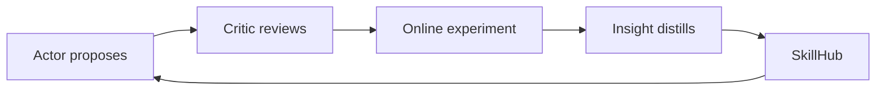
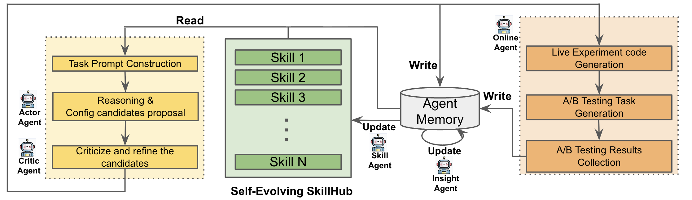

# AgenticRecTune：以多 Agent 和自进化 SkillHub 优化推荐系统

> **Fidelity: 核心机制复现**。本地真正运行三轮 Actor 提案、Critic 评价和 SkillHub 继承，可直接观察每轮候选与冠军。

## 论文信息

| 项目 | 内容 |
| --- | --- |
| 论文链接 | [arXiv 2604.26969](https://arxiv.org/abs/2604.26969) |
| 公司/机构 | Google / Discover |
| 首次公开日期 | 2026-04-21（arXiv v1） |
| 原文开源代码 | 否：论文未提供官方/作者代码（核查日期：2026-08-09） |
| Adapter | `agentic-rec-tune` |
| 本地复现代码 | [`src/auto_research/reproductions/agentic_rec_tune/`](https://github.com/daiwk/auto-research/tree/main/src/auto_research/reproductions/agentic_rec_tune/) |

## 原始论文总结

### 背景与主要改动

推荐系统配置跨召回、融合和重排，人工调节反馈慢且知识难复用。AgenticRecTune 将工作拆成 Actor、Critic、Insight、Skill、Online 五类 agent：生成方案、审查风险、总结洞见、沉淀技能，并从真实实验平台取回反馈形成闭环。



<!-- paper-figure:start -->
### 原论文关键图

[](https://arxiv.org/html/2604.26969v2#S1.F1)

> 原论文 Figure 1：多 Agent 从配置提案到在线结果回流的完整工作流。图片来自[原论文](https://arxiv.org/abs/2604.26969)，版权归原作者所有。
<!-- paper-figure:end -->

### 核心公式

本地将每轮研究写成可审计状态更新：

$$
g_{t+1}=\arg\max_{g\in\operatorname{Actor}(g_t,\mathcal S_t)}\operatorname{Critic}(g;D_{val}),\qquad \mathcal S_{t+1}=\mathcal S_t\cup\{g_{t+1}\}.
$$

### 论文离线与线上效果

- Value-Based Retrieval/pre-ranking：Engagement1 `+0.75%`、Engagement2 `+0.90%`、Diversity `+0.48%`。
- Value Fusion/ranking：`+0.62% / +0.19% / +0.06%`。
- Diversity/re-ranking：`+0.21% / +0.29% / +3.43%`；在线 A/B 为 live traffic 且 `p<0.05`。

## 本地复现

> **本地对照口径**：基线为固定手调排序配方，实验组运行三轮 Actor–Critic–SkillHub；NDCG@10 相对 `+17.34%`。

三轮、每轮最多九个排序 genome，Critic 只看 validation，最终 test 隔离。冠军权重为 transition/content/diversity=`0.30/0.35/0.35`；相对固定手调基线 Hit@10 `+8.33%`、NDCG@10 `+17.34%`、fresh Hit@10 `+150%`。

指标见 [`metrics/movielens-100k-seed42.json`](metrics/movielens-100k-seed42.json)。

```bash
auto-research reproduce --paper agentic-rec-tune --dataset-dir data --seed 42
```

## 复现边界

动作空间是本地可执行排序权重，不接 Google 实验排期 API，也不把确定性 validation 评价冒充线上 Agent。
