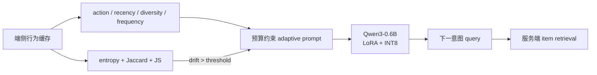

# RecGPT-Mobile：端侧用户意图理解

> **Fidelity: 核心机制复现**。实际执行 causal LM LoRA SFT、预算约束 adaptive prompt、意图漂移触发与 INT8 权重量化；私有数据和手机端系统缩小。

## 论文信息

| 项目 | 内容 |
| --- | --- |
| 论文链接 | [arXiv 2605.04726](https://arxiv.org/abs/2605.04726) |
| 公司/机构 | Alibaba / Taobao |
| 首次公开日期 | 2026-05-06（arXiv v1） |
| 原文开源代码 | 否：论文未提供官方/作者代码（核查日期：2026-07-22） |
| Adapter | `recgpt-mobile` |
| 本地复现代码 | [`src/auto_research/reproductions/recgpt_mobile/`](https://github.com/daiwk/auto-research/tree/main/src/auto_research/reproductions/recgpt_mobile/) |

## 原始论文总结

### 背景与主要改动

云端 LLM 能把点击、加购、收藏、购买等隐式行为翻译成显式搜索意图，但频繁上传行为并推理会增加成本、延迟和隐私风险。RecGPT-Mobile 把 Qwen3-0.6B 量化模型放到手机端，形成“本地收集行为→自适应构造 prompt→生成下一 query→服务端检索”的链路。

训练数据由行为/搜索日志 `60%`、共购关系 `20%`、GPT 改写 `15%` 和人工标注 `5%` 组成；LoRA SFT 学习行为到 query 的映射。Prompt 先根据动作、时效、多样性和频率选择模板，再逐个加入有正边际收益且不超预算的组件。推理仅在 entropy、Jaccard 和 JS divergence 共同表明意图发生漂移时触发。



### 核心公式

$$
q^*=\arg\max_{q\in\mathcal Q}P(q\mid\mathcal B)
\quad\text{s.t. resource constraints}.
$$

$$
\Delta_{\mathrm{intent}}=
\lambda_1\lvert H(P_t)-H(P_{t-1})\rvert+
\lambda_2(1-JA(Z_t,Z_{t-1}))+
\lambda_3\operatorname{JS}(P_t,P_{t-1}).
$$

论文使用 $\lambda=(0.4,0.3,0.3)$、$\tau=0.8$，仅当 $\Delta_{\mathrm{intent}}>\tau$ 时重新生成 query。

### 论文离线与线上效果

Qwen3-4B evaluator 下，Qwen3-0.6B Base/LoRA/LoRA+Quant 总分为 `0.677 / 0.829 / 0.794`；8B evaluator 下为 `0.613 / 0.783 / 0.760`，说明量化只有小幅质量损失。淘宝四个 Feed 场景持续一个月、覆盖数千万用户，平均 CLICK `+1.8%`、PAY `+2.7%`、GMV `+2.5%`。

## 本地复现

> **本地对照口径**：基线为同一 SmolLM2-135M-Instruct 的零样本 intent completion；实验组只训练 q/v LoRA，并在同一 18 类候选集合上比较，semantic accuracy 相对 `+100.00%`；量化组使用相同 LoRA 权重的逐输出通道 INT8。

MovieLens-1M 构造 23,472 条行为→下一电影类型样本，最多 96 prompt tokens，评估 32 users。24-step 第一轮训练 loss 下降但 accuracy 持平；第二轮增加到 80 steps 后，Base primary/semantic accuracy 为 `0.0625 / 0.2500`，LoRA 为 `0.4062 / 0.5000`，semantic accuracy 相对 `+100.00%`。INT8 为 `0.3750 / 0.4688`，semantic accuracy 相对 LoRA `-6.25%`，序列化体积 `513.24→237.72 MiB`（`-53.68%`）。论文触发公式在 290 个 test users 上平均 drift `0.4302`、触发率 `3.79%`，即 `96.21%` 请求可复用旧意图。

Mac PyTorch 没有启用 INT8 linear kernel，因此权重确实以 INT8 存储，但前向需要反量化，测得延迟 `573 ms`，比 LoRA FP32 的 `197 ms` 更慢；该数值不能代表手机端部署。稳定指标见 [`metrics/movielens-1m-seed42.json`](metrics/movielens-1m-seed42.json)。

```bash
auto-research reproduce --paper recgpt-mobile --seed 42
```

## 复现边界

本地模型是真实 causal LM 和 LoRA，不是类型分类 MLP；adaptive prompt、三项漂移公式和量化路径均执行。MovieLens 类型替代淘宝搜索 query，没有 GPT 改写、人工标注、生产检索和真机 fleet，故只验证方法链路与相对趋势。
