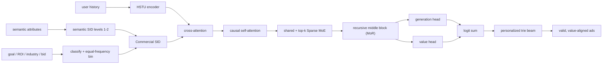

# UniVA：工业广告生成式推荐的统一价值对齐

> **Fidelity: 完整核心链路**。本地实际执行 Commercial SID、HSTU 用户编码、cross-attention → causal self-attention 解码、MoR、共享专家 + top-k Sparse MoE、generation/value 双头、监督学习与 PPO/value 交替训练，以及 value-guided 个性化 trie beam search。腾讯私有广告属性、eCPM 模拟器、候选库存、MCTS 数据和线上流量由公开数据上的确定性代理替换。

- 论文：[arXiv 2605.05803](https://arxiv.org/abs/2605.05803)，Tencent / WeChat Channels，2026-05
- Adapter：`univa`；代码：`src/auto_research/reproductions/univa/`
- 本地数据：MiniOneRec Amazon Reviews 2018 `Office_Products`，使用官方交互切分、Qwen 商品向量和三段式 SID

## 原始论文总结

### 背景与主要改动

传统生成式推荐主要优化用户行为匹配，却没有直接表示广告主的出价、ROI、优化目标等商业价值；工业广告还要求生成路径合法、满足请求级库存约束。UniVA 将“用户偏好、商业价值、可投放性”放进同一套生成式模型：Commercial SID 在语义 token 后编码商业属性；Generation-as-Ranking 用生成头和价值头联合给路径打分；eCPM-aware RL 让策略直接偏向请求内相对高价值广告；个性化 trie 则保证 beam 只沿当前请求可投放的广告路径展开。

论文的三项关键改动是：

1. 用前两级语义 token 加一个 Commercial token 构造三段式 SID；商业属性先分类，再在每类内按 bid 等频分桶，并受总词表预算约束。
2. HSTU 编码历史后，解码器依次做 cross-attention、causal self-attention、Sparse MoE；中间块递归复用（MoR），generation/value 两个 vocabulary head 的 logits 逐元素相加。
3. 先 SFT，再交替执行监督更新和 PPO/value 更新；serving 时在请求级个性化 trie 上做 value-guided beam search。



### 核心公式

Commercial SID 保留物品语义编码的前两级，并用商业分类和类内 bid 分桶得到最后一级：

$$SID_i=(s_i^{(1)},s_i^{(2)},c_i),\qquad
c_i=\operatorname{offset}(a_i)+\operatorname{EqFreqBin}(b_i\mid a_i),$$

其中 $a_i$ 表示优化目标、ROI 档位和行业等属性组合，所有分类的分桶数满足 $\sum_a n_a\leq V_c$。

Generation-as-Ranking 将生成相关性与价值 logit 相加后再归一化：

$$p(s_t\mid x,s_{<t})=\operatorname{softmax}\!\left(z^{gen}_t+z^{value}_t\right).$$

监督阶段优化逐 token 负对数似然。强化阶段在同一请求候选内标准化 eCPM 奖励 $r$，用 clipped PPO 更新策略，并回归价值头：

$$\mathcal L_{PPO}=-\mathbb E\left[\min(\rho_t A_t,\operatorname{clip}(\rho_t,1-\epsilon,1+\epsilon)A_t)\right],$$

$$\mathcal L_V=\mathbb E[(V_\theta-r)^2],\qquad
\mathcal L_{RL}=\mathcal L_{PPO}+\lambda_V\mathcal L_V.$$

个性化 trie beam 仅扩展当前请求库存集合 $\mathcal I_u$ 中存在的前缀，并累计双头融合分数：

$$S(s_{1:L})=\sum_{t=1}^{L}\log p(s_t\mid x,s_{<t}),\qquad s_{1:L}\in Trie(\mathcal I_u).$$

### 论文离线与线上效果

论文在腾讯私有工业广告数据上报告逐模块增益；下表百分比均为论文相对其生产基线的结果，不是本地结果。

| Paper configuration | HR@100 relative lift |
|---|---:|
| + Commercial SID | +5.78% |
| + Mixture of Recursion | +13.56% |
| + Sparse MoE | +18.40% |
| UniVA full | **+37.04%** |

完整模型同时报告 ValueHR@100 `+37.01%`、wNDCG@100 `+26.20%`。线上实验使用 WeChat Channels 广告 5% 流量，时间为 2026-03-07 至 2026-03-11：

| Online A/B | GMV | GMV(normal) |
|---|---:|---:|
| v1：不含 Generation-as-Ranking | +1.03% | +1.17% |
| v2：UniVA full | **+1.50%** | **+1.42%** |

## 本地复现

> **本地对照口径**：基线是同一 MiniOneRec Office 数据、相同 HSTU/decoder 容量、步数、随机种子和全商品目录下的 `semantic_sid_sl`（原始三级 Semantic SID + 监督学习）；实验组 `univa_full` 改用 Commercial SID，并开启 generation/value 双头与交替 PPO/value 训练。validation 选中的实验组在 held-out test 上 HR@100 相对基线 **+4.76%**，ValueHR@100 **+6.56%**，但 wNDCG@100 **-8.43%**。这是本地公开代理数据的 matched ablation，不是相对 DIN，也不是论文线上 A/B。

本轮使用 12,000 条训练样本、32 个 validation 用户、32 个 test 用户、完整 3,459 商品目录和 seeds 42/43/44；每个变体训练 80 steps。选型规则预先固定为 validation ValueHR@100，其次 HR@100，test 不参与选择。

| Local variant | Test HR@10 | HR@50 | HR@100 | ValueHR@100 | wNDCG@100 |
|---|---:|---:|---:|---:|---:|
| semantic_sid_sl（基线） | 0.09375 | 0.16667 | 0.21875 | 0.39709 | **0.15464** |
| commercial_sid_sl | **0.10417** | **0.18750** | **0.26042** | **0.46227** | 0.13625 |
| univa_full（validation 选中） | 0.09375 | **0.18750** | 0.22917 | 0.42315 | 0.14161 |

验证集上 `univa_full` 的 ValueHR@100 为 0.32079，高于 semantic baseline 的 0.30894 和 commercial-only 的 0.30933，因此被选中。测试集上 commercial-only 反而取得最高 HR/ValueHR，说明当前小预算 PPO/value 阶段没有稳定超过 Commercial SID 单独收益；同时它降低了排序靠前位置的价值折损指标 wNDCG，不能据此宣称完整方法全面复现论文增益。

Commercial token 的机制诊断是正向的：以相同前两级语义前缀分组，组内 bid proxy 的平均标准差由 0.34956 降至 0.09773（-72.04%）。serving 诊断中，无约束 beam 平均只有 13.42/50 条路径能映射到真实物品，个性化 trie 为 50/50；value-guided beam 的平均 eCPM proxy 从 0.42554 变为 0.42510（-0.10%），本地没有验证出额外价值提升。

```bash
# 首次运行会复用/下载 MiniOneRec Office 的公开文件
AUTO_RESEARCH_UNIVA_STEPS=80 \
AUTO_RESEARCH_UNIVA_TRAIN_ROWS=12000 \
AUTO_RESEARCH_UNIVA_EVAL_USERS=32 \
AUTO_RESEARCH_UNIVA_SEEDS=3 \
auto-research reproduce --paper univa --seed 42
```

稳定指标见 [`metrics/office-seeds42-44.json`](metrics/office-seeds42-44.json)。数据、原始运行目录和 checkpoint 不提交 Git；复现实验只需上述命令。

## 复现边界

- 真实实现并执行了论文的四段核心链路，而不是用最终分数加权模拟网络、RL 或 trie。
- 公开数据没有广告优化目标、ROI、行业、bid、pCTR/pCVR 快照；本地分别用品牌、流行度分位、Qwen embedding 聚类和确定性 bid/eCPM proxy 替换。
- 未复刻腾讯的 2048 codebook、256 维四层 decoder、64 experts/top-16、大规模 MCTS 数据和生产库存；Mac 配置缩放为 48 维、4 experts/top-2、MoR 2 轮。
- 本地指标只能验证实现链路和公开代理数据上的行为，不能外推为 GMV 或线上广告收益。
