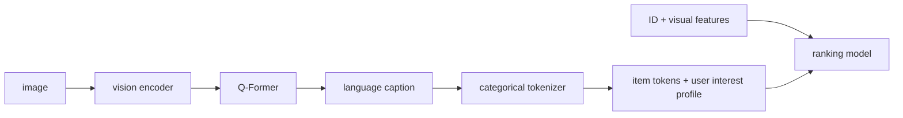

# MM-LLM：工业推荐中的多媒体理解特征

> **Fidelity: 核心机制复现**。内容 encoder、query cross-attention、离散 caption token、用户语义兴趣和 ID/视觉排序融合均训练；原始私有图片及 BLIP-2/LLaMA2-1.5B 规模未复刻。

## 原始论文总结
### 背景与主要改动
视觉 embedding 难表达细粒度语义。论文用视觉 encoder+Q-Former 对齐 LLaMA2 生成 caption，再规范化为 categorical token IDs；item tokens 和用户历史 token profile 与 ID/视觉特征拼接进入生产排序模型，LLM 推理脱离在线主链路。

### 核心公式
caption 学习 $L_{cap}=BCE(\hat a,a)$；排序融合 $e_i=e_{id}+e_{visual}+g(e_{id},e_{cap})\odot e_{cap}$，再以全库 CE 训练 next-item。
### 论文离线与线上效果
MM-LLM token 特征 AUC gain 最高 0.16%、NE 0.07%，摘要报告离线 AUC **+0.35%**；线上 engagement **+0.02%**，训练与 serving QPS 基本中性。

## 本地复现
MovieLens content vector 替代私有图片，轻量 query cross-attention 生成 4 个 caption tokens。统一 DIN（100 steps）Hit/NDCG 为 0.0481/0.02167；MM-LLM 为 0.0352/0.01880，NDCG 相对 DIN **-13.23%**。caption 模块相对 ID+content 内部基线仅 **+0.03%** 且 Hit 下降，本地未验证有效收益。指标见 [`metrics/movielens-100k-seeds42-44.json`](metrics/movielens-100k-seeds42-44.json)。
