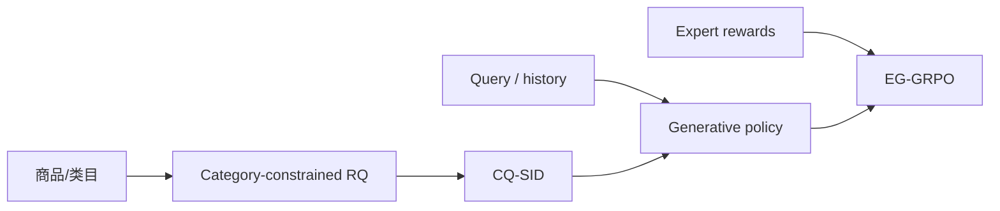

# CQ-SID

> **Fidelity: 核心机制复现**。实现类目约束 Semantic ID、残差量化、多信号奖励和 EG-GRPO 更新。

## 论文信息

| 项目 | 内容 |
| --- | --- |
| 论文链接 | [arXiv 2605.14434](https://arxiv.org/abs/2605.14434) |
| 公司/机构 | Alibaba Taobao & Tmall Group |
| 首次公开日期 | 2026-05-14（arXiv v1） |
| 原文开源代码 | 否：论文未提供官方/作者代码（核查日期：2026-07-28） |
| Adapter | `cq-sid` |
| 本地复现代码 | [`src/auto_research/reproductions/cq_sid/`](https://github.com/daiwk/auto-research/tree/main/src/auto_research/reproductions/cq_sid/) |

## 原始论文总结

### 背景与主要改动

论文让首级 SID 服从商品类目，再用残差码表达类目内差异；Expert-Guided RL 组合点击、购买、语义与约束信号优化生成检索。



### 核心公式

$$
s_i=(c_i,q_i^{(1)},q_i^{(2)}),\qquad
A_j=\frac{r_j-\operatorname{mean}(r_{1:G})}{\operatorname{std}(r_{1:G})+\epsilon}.
$$

### 论文离线与线上效果

TmallAPP Search 两周 A/B：GMV **+1.15%**、UCTCVR **+0.40%**；论文另报 semantic click hit rate **+26.76%**。

## 本地复现

> **本地对照口径**：基线是协同 item-ID 检索；实验组执行 CQ-SID 与 240 次 group-relative policy update；NDCG@10 相对 **+1.66%**。

```bash
auto-research reproduce --paper cq-sid
```

结构化结果见 [`metrics/movielens-100k-seed42.json`](metrics/movielens-100k-seed42.json)。

## 复现边界

没有复刻 64-GPU 渐进训练、Tmall 私有 query log 和生产 beam service；EG-GRPO 更新本身真实执行。
