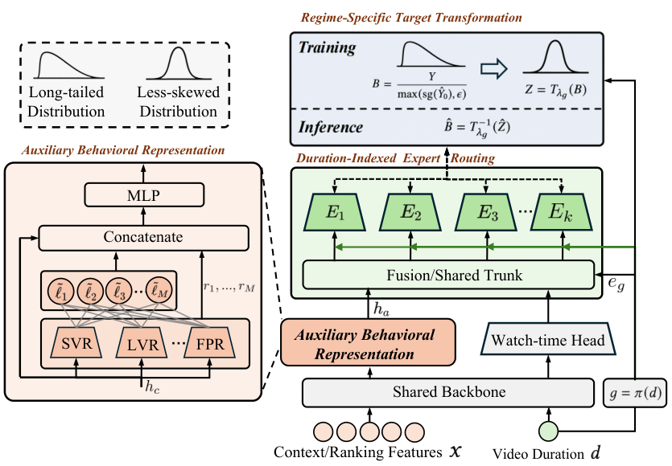

# DADF: A Distribution-Aware Debiasing Framework for Watch-Time Regression in Recommender Systems

> **保真度：核心机制复现**。原文结论、本地公开数据实验和未复刻部分分开陈述。

## 论文信息

| 项目 | 内容 |
| --- | --- |
| 论文链接 | [arXiv 2605.17863](https://arxiv.org/abs/2605.17863) |
| 公司/机构 | Kuaishou Technology |
| 首次公开日期 | 2026-05-18（arXiv v1） |
| 原文开源代码 | 是：[DADF](https://github.com/liuzhao09/DADF) |
| Adapter | `dadf` |
| 本地复现代码 | [`src/auto_research/reproductions/dadf/`](https://github.com/daiwk/auto-research/tree/main/src/auto_research/reproductions/dadf/) |

## 原始论文总结

### 背景与主要改动

冻结成熟的第一阶段 watch-time 模型，按条件分布学习乘性残差校正，并保持线上标量接口不变。


<!-- paper-figure:start -->
### 原论文关键图

[](https://arxiv.org/html/2605.17863v3/03_framework.png)

> **原论文 Figure 2（关键图）**：展示原论文的训练流程与关键优化环节。图片来自[原论文](https://arxiv.org/abs/2605.17863)，版权归原作者所有；点击图片可查看来源。
<!-- paper-figure:end -->

### 核心公式

$$
\hat y=\hat y_0\,b_\phi(x,\hat y_0),\quad b^*=y/\max(\hat y_0,\epsilon)
$$

### 论文离线与线上效果

原文的主要线上证据为 **average time spent per device +0.65%**（7-day A/B, then 100% traffic）。论文离线表与线上指标使用私有或论文指定口径，不能与下面的 MovieLens 数字直接比较。

## 本地复现

> **本地对照口径**：基线为共享 transition + content scorer；实验组在相同用户、物品、全库候选和 seed 上只加入 `dadf` 核心机制，相对 NDCG@10 +0.00%。

MovieLens-100K、220 users / 360 items、seed 42：NDCG@10 0.0540 → **0.0540（+0.00%）**，Hit@10 0.1091 → 0.1091。验证集只用于选择机制混合权重，测试集没有参与调参。

```bash
auto-research reproduce --paper dadf --dataset-dir data --seed 42
```

固定指标见 [`metrics/public-seed42.json`](metrics/public-seed42.json)。

## 复现边界

在 MovieLens-100K 固定全库候选、相同切分和 seed 上执行论文核心机制；公司私有特征、生产基础模型与在线流量不可公开，论文 A/B 数字仅作原文引用。 本地实现执行了独立的模型状态和打分路径；它不是把论文名映射到同一个加权公式。未复刻项见 adapter 的 `omitted_core_components`，本地相对变化不得与原文 A/B 提升混写。
