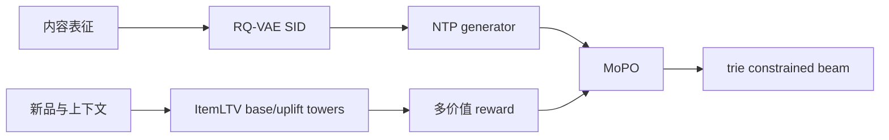

# GrowthGR：面向新品长期价值的生成式召回

> **Fidelity: 核心机制复现**。ItemLTV、三层 Semantic ID、NTP、MoPO/GRPO clipped update 与有效 SID 约束均实际执行。

## 论文信息

| 项目 | 内容 |
| --- | --- |
| 论文链接 | [arXiv 2605.17994](https://arxiv.org/abs/2605.17994) |
| 公司/机构 | Alibaba Group / Taobao & Tmall |
| 首次公开日期 | 2026-05-18（arXiv v1） |
| 原文开源代码 | 否：未找到作者公开代码（核查日期：2026-07-16） |
| Adapter | `growthgr` |
| 本地复现代码 | [`src/auto_research/reproductions/growthgr/`](https://github.com/daiwk/auto-research/tree/main/src/auto_research/reproductions/growthgr/) |

## 原始论文总结

### 背景与主要改动

新品只按即时成交优化会持续缺曝光。GrowthGR 用 counterfactual ItemLTV 估计点击带来的长期订单增量，再以 RQ-VAE SID 和 decoder-only generator 召回；MoPO 联合购买、点击、曝光、排序和高 uplift 标签，并用 clipped inverse propensity 强化稀有高价值物品。



### 核心公式

$$
\hat y=G_{base}(X)+W\,G_{uplift}(X),\qquad r_i=\operatorname{Clip}(-\log\pi_{old}(o_i|x),1,M)\sum_kw_ks_k.
$$

$$
\mathcal J^{CLIP}=\min(\rho A,\operatorname{clip}(\rho,1-\epsilon,1+\epsilon)A).
$$

### 论文离线与线上效果

Taobao/Tmall 线上新品 GMV `+5.3%`、全站搜索 GMV `+0.3%`。

## 本地复现

> **本地对照口径**：基线是同一 transition policy 的 NTP retrieval；实验组 GrowthGR 加入 ItemLTV 与 8 轮 MoPO，相对基线 Hit@10 `+0.00%`、NDCG@10 **`+2.05%`**。

head share 同时下降 `3.06%`；验证集选择 blend `0.1`。稳定指标见 [`metrics/movielens-100k-seed42.json`](metrics/movielens-100k-seed42.json)。

```bash
auto-research reproduce --paper growthgr --seed 42
```

## 复现边界

未来正反馈频次代理 7 日订单，公开数据不支持还原真实搜索漏斗和多模态商品 foundation embedding。
