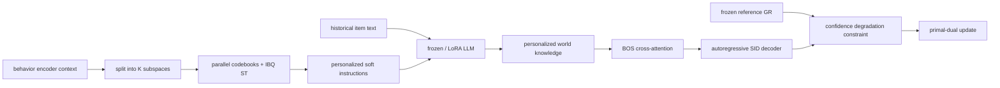

# LWGR：带 Lagrangian 约束的个性化世界知识生成推荐

> **Fidelity: 完整核心链路**。本地实际执行 parallel codebook、IBQ straight-through、用户 soft instruction 进入真实冻结 causal LLM、BOS cross-attention、冻结生成式 reference，以及逐步 primal-dual 更新。未用静态文本向量替代个性化 LLM 前向。

## 论文信息

| 项目 | 内容 |
| --- | --- |
| 论文链接 | [arXiv 2605.18771](https://arxiv.org/abs/2605.18771) |
| 公司/机构 | Alibaba International / CAS |
| 首次公开日期 | 2026-04-16（arXiv v1） |
| 原文开源代码 | 否：论文未提供官方/作者代码（核查日期：2026-07-15） |
| Adapter | `lwgr` |
| 本地复现代码 | [`src/auto_research/reproductions/lwgr/`](https://github.com/daiwk/auto-research/tree/main/src/auto_research/reproductions/lwgr/) |

## 原始论文总结

### 背景与主要改动

固定人工 prompt 提取的 LLM 知识既不能表达用户兴趣异质性，也可能与行为信号冲突。LWGR 将用户上下文切成多个子空间，每个子空间从独立 codebook 选择 codeword，形成可端到端学习的个性化 soft instruction；soft tokens 与历史商品文本共同通过 LLM，得到用户级 world knowledge。生成式推荐 decoder 在 BOS 处 cross-attend 这些知识，同时用相对冻结 reference 的置信度退化约束控制有害融合。

线上将 LLM world knowledge 在 nearline 秒/分钟级预计算并存入用户向量库；请求侧只做一次 lookup 和一层 cross-attention。



### 核心公式

第 $k$ 个子空间对 codeword 的 soft distribution 和 straight-through index：

$$
p_j^k=\frac{\exp(\operatorname{sim}(u^k,C_k[j])/\tau)}{\sum_l\exp(\operatorname{sim}(u^k,C_k[l])/\tau)},
$$

$$
e^k=e_{hard}^k-\operatorname{sg}[p^k]+p^k,\quad t_u^k=W_L^k(e^k)^TC_k.
$$

LLM 输出 $H_u$ 在 decoder BOS 处融合：

$$
\tilde q_0=\operatorname{CrossAttn}(q_0,H_u).
$$

相对冻结 reference 的平均 token log-prob 退化为：

$$
C=\mathbb E\left[\max(0,s_{ref}(u,i^+)-s_\theta(u,i^+)-\delta)\right].
$$

优化目标与 dual update：

$$
\min_\theta\max_{\lambda\ge0}\ \mathcal L_{rec}+\lambda(C-\epsilon),
$$

$$
\lambda\leftarrow\max(0,\lambda+\eta_\lambda(C-\epsilon)).
$$

### 论文离线与线上效果

| Beauty model | Recall@5 | NDCG@5 | Recall@10 | NDCG@10 |
|---|---:|---:|---:|---:|
| TIGER | 0.0534 | 0.0341 | 0.0912 | 0.0630 |
| strongest prompt baseline | 0.0543 | 0.0347 | 0.0931 | 0.0642 |
| LWGR | **0.0595** | **0.0376** | **0.1026** | **0.0701** |

论文在三套数据上的最大相对提升为 `11.23%`。2025-12-19 至 12-30，东南亚广告平台 control/Treatment 各 15% 用户：Revenue `+1.35%`、GMV `+0.83%`、CTR `+1.17%`，均 p<0.05；延迟从 13.35ms 到 13.55ms。

## 本地复现

> **本地对照口径**：基线是相同 Office SID、相同 48 维 GR backbone、seeds 42/43/44 的冻结 `reference`；实验组 `lwgr` 从该 checkpoint 初始化，加入真实 LLM soft-instruction、cross-attention 和 primal-dual 训练。validation 仍选择 reference；test Recall@10 均为 0.04861（**0.00%**），LWGR NDCG@10 从 0.01853 到 0.01774（**-4.29%**）。这是论文 reference constraint 对照，不是 DIN，也不是线上 A/B。

本轮 12,000 train、48 validation、48 test 用户，全 3,459 商品目录；reference 180 steps，两个 knowledge variant 各 100 steps。

| Local variant | Recall@5 | NDCG@5 | Recall@10 | NDCG@10 |
|---|---:|---:|---:|---:|
| reference（validation 选中） | **0.02778** | **0.01184** | 0.04861 | **0.01853** |
| unconstrained fusion | 0.02083 | 0.00945 | 0.04861 | 0.01881 |
| LWGR primal-dual | 0.02083 | 0.00867 | 0.04861 | 0.01774 |

约束版本的 Lagrange multiplier 从 0.05 上升到约 0.0534，证明 dual update 实际发生；但平均置信度退化约束约 0.0674，并未低于无约束版本约 0.0659。因此本地只验证实现和梯度路径，未验证约束有效性或论文准确率收益。

```bash
AUTO_RESEARCH_LWGR_REFERENCE_STEPS=180 \
AUTO_RESEARCH_LWGR_POLICY_STEPS=100 \
AUTO_RESEARCH_LWGR_EVAL_USERS=48 \
AUTO_RESEARCH_LWGR_SEEDS=3 \
auto-research reproduce --paper lwgr --seed 42
```

稳定指标见 [`metrics/office-seeds42-44.json`](metrics/office-seeds42-44.json)。checkpoint 与原始 runs 不提交。

## 复现边界

- 使用真实 SmolLM2-135M 前向，soft instruction 的梯度穿过冻结 LLM 回到 codebook；未用预计算常量冒充该步骤。
- Qwen3-4B、Beauty/Toys 全量和 29.5 亿工业交互缩为 Office 本地预算；模型尺寸变化可能改变知识可用性。
- 保留论文 $delta=\epsilon=10^{-4}$、$\lambda_0=0.05$、dual learning rate `5e-4`。
- 未实现线上 nearline repository，但本地 serving state 可在 LLM 前向后缓存；不声称毫秒级生产延迟。
