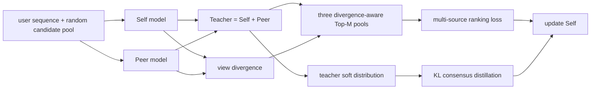

# MDCNS: Divergence Meets Consensus

> **Fidelity: 核心机制复现**。三源负采样、双模型分歧/共识选择与更新实际执行；推荐 backbone 缩小为本地可训练模型。

## 论文信息

| 项目 | 内容 |
| --- | --- |
| 论文链接 | [arXiv 2605.19651](https://arxiv.org/abs/2605.19651) |
| 公司/机构 | 论文作者团队（原文未标注公司） |
| 首次公开日期 | 2026-05-19（arXiv v1） |
| 原文开源代码 | 是：[官方/作者代码](https://github.com/Lyz103/SIGIR26-MDCNS) |
| Adapter | `mdcns` |
| 本地复现代码 | [`src/auto_research/reproductions/mdcns/`](https://github.com/daiwk/auto-research/tree/main/src/auto_research/reproductions/mdcns/) |

## 原始论文总结

### 背景与主要改动

随机负采样太容易，DNS 只追逐单模型高分负例又容易产生 false negative、低多样性和模型偏置。MDCNS 受“最近发展区”启发，引入 Self、Peer、Teacher 三个视角：Self 与异构 Peer 分别评分，Teacher 聚合两者；再用两模型分歧提升“困难且有信息量”的候选，最后把 Teacher 在完整候选池上的分布蒸馏回 Self，避免候选打分只利用一个负例。

### 核心公式

候选由未交互集合均匀抽取，Self/Peer 评分与分歧为

$$
s_{u,v}^{self}=h_u^{self}\cdot e_v,\quad s_{u,v}^{peer}=h_u^{peer}\cdot e_v,
$$
$$
s_{u,v}^{teacher}=s_{u,v}^{self}+s_{u,v}^{peer},\quad d_{u,v}=|s_{u,v}^{self}-s_{u,v}^{peer}|.
$$

各视角用 $\widetilde s_{u,v}^{*}=s_{u,v}^{*}+d_{u,v}$ 重排，从 Top-M 随机抽一个负例。总目标为

$$
\mathcal L_{rec}=\alpha\mathcal L_{self}+\beta\mathcal L_{peer}+\gamma\mathcal L_{teacher},
$$
$$
p_{u,v}^{*}=\operatorname{softmax}(s_{u,v}^{*}/\tau),\quad
\mathcal L=\mathcal L_{rec}+\mu\tau^2 KL(p^{teacher}\Vert p^{self}).
$$

### 论文离线与线上效果

论文使用 Beauty、Toys、Sports、Health、LastFM、KuaiRand，按 70/20/10 切分，报告 Recall/NDCG@5/10/20。以主表中的公开数据为例：

| Dataset | 最强 baseline NDCG@10 | MDCNS | 相对提升 |
|---|---:|---:|---:|
| Beauty | 0.0497 | 0.0685 | +37.83% |
| Toys | 0.0586 | 0.0765 | +30.55% |
| Sports | 0.0269 | 0.0340 | +26.39% |
| Health | 0.0393 | 0.0516 | +31.29% |

论文是公开离线实验，没有报告线上 A/B。

## 本地复现

> **本地对照口径**：主基线是 Uniform negative sampling，辅助基线是 DNS；实验组是 MDCNS；NDCG@10 相对 Uniform 从 0.003016 升至 0.006175（**+104.75%**）。这是采样策略消融；DIN 不适用于该采样器级比较。

本轮不再使用 MovieLens proxy，而是自动下载作者仓库的 Beauty 切分：123,086/4,472/2,237 条 train/val/test 序列，12,101 个物品。轻量双 embedding backbone 实现三源采样、分歧重排和 KL distillation；为控制 Mac 时间，固定抽取 50,000 个训练样本、4 epochs、30 候选、Top-M=5。

| Sampler | Hit@10 | NDCG@10 |
|---|---:|---:|
| Uniform | 0.003576 | 0.003016 |
| DNS | 0.003576 | 0.002507 |
| MDCNS | **0.008046** | **0.006175** |

MDCNS 相对 Uniform 的 NDCG@10 为 **+104.75%**。绝对值低于论文，原因包括轻量一阶 Markov backbone、训练样本上限和未复刻 SASRec/Mamba4Rec；因此结论只支持“核心采样路径在同源公开数据上有效”。结构化指标见 [`metrics/amazon-beauty-seed42.json`](metrics/amazon-beauty-seed42.json)。
