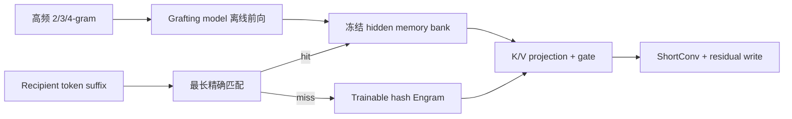

# Memory Grafting：离线构造条件记忆扩展 LLM 容量

> **Fidelity: 核心机制复现**。实际训练 grafting model 与 recipient，执行冻结 n-gram hidden bank、最长精确匹配、Engram fallback、query-key gate、短卷积和残差写入。

## 论文信息

| 项目 | 内容 |
| --- | --- |
| 论文链接 | [arXiv 2605.20948](https://arxiv.org/abs/2605.20948) |
| 公司/机构 | Tsinghua University / Microsoft Research Asia |
| 首次公开日期 | 2026-05-20（arXiv v1） |
| 原文开源代码 | 否：论文未提供官方/作者代码（核查日期：2026-07-22） |
| Adapter | `memory-grafting` |
| 本地复现代码 | [`src/auto_research/reproductions/memory_grafting/`](https://github.com/daiwk/auto-research/tree/main/src/auto_research/reproductions/memory_grafting/) |

## 原始论文总结

### 背景与主要改动

Engram 的大容量条件记忆需要随主模型从零训练。Memory Grafting 先统计高频 2/3/4-gram，用已经预训练的 grafting model 离线编码每个短语最后 token 的中间 hidden state并冻结；recipient 在线只做期望 $O(1)$ 的最长后缀精确查询。未命中时回退到可训练 hash Engram，命中值经独立投影、上下文门控、短卷积后写回 residual stream。



### 核心公式

$$
W_{\mathrm{mem}}[i]=F_G(\mathrm{text}(m_i))_{\mathrm{last}}^{(r)},
$$

$$
\alpha=\sigma\!\left(\frac{\langle\operatorname{RMSNorm}(K),\operatorname{RMSNorm}(H)\rangle}{\sqrt D}\right),\qquad
\widetilde H=H+\alpha V+\operatorname{ShortConv}(\alpha V).
$$

### 论文离线与线上效果

论文 2.8B 设置的九项 benchmark 平均分：MoE `51.95`、vanilla Engram `52.43`、Memory Grafting `53.86`；0.92B 设置中不同 grafting model 也均优于基线。3M-entry bank 的训练/推理吞吐约为 MoE 的 `0.92×/0.95×`。纯 LLM 预训练论文没有线上 A/B，本项目按公开 benchmark 与同预算训练对照筛选。

## 本地复现

> **本地对照口径**：基线是同结构普通 Transformer；实验组 Memory Grafting 的 validation PPL `470.121→453.257`，相对降低 **`3.59%`**；相对同参数 Engram `453.117→453.257`，为 **`-0.03%`**（未超过 Engram）。

WikiText-2 使用 180k train tokens、24k validation tokens、BPE-1024、64 hidden、45 recipient steps。teacher 另训 30 steps；192 个冻结 n-gram 的 validation exact hit rate 为 `8.33%`。结果说明完整 grafting 路径有效且优于无记忆模型，但当前 bank 太小，未验证相对 Engram 的增益。稳定指标见 [`metrics/wikitext2-seed42.json`](metrics/wikitext2-seed42.json)。

```bash
pip install -e '.[llm-evolution]'
auto-research reproduce --paper memory-grafting --seed 42 --device auto
```

## 复现边界

64-d dense recipient、微型 teacher 与 192-entry bank 替代论文 0.92B/2.8B MoE、Qwen3.5/DeepSeek grafting model、50B/100B tokens 和 3M-entry bank；不把本地 PPL 外推为论文 benchmark 分数。
