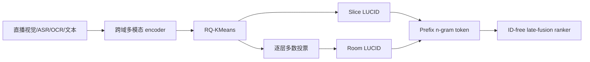

# FLUID：用多模态语义码替代直播间瞬时 ID

> **Fidelity: 核心机制复现**。执行跨域内容融合、slice/room 两级 LUCID、RQ-KMeans、prefix n-gram、ID-free late fusion 与三阶段 warmup；公开数据替代生产多模态流量。

## 论文信息

| 项目 | 内容 |
| --- | --- |
| 论文链接 | [arXiv 2605.21832](https://arxiv.org/abs/2605.21832) |
| 公司/机构 | TikTok / ByteDance |
| 首次公开日期 | 2026-05-20（arXiv v1） |
| 原文开源代码 | 否：论文未提供官方/作者代码（核查日期：2026-07-15） |
| Adapter | `fluid` |
| 本地复现代码 | [`src/auto_research/reproductions/fluid/`](https://github.com/daiwk/auto-research/tree/main/src/auto_research/reproductions/fluid/) |

## 原始论文总结

### 背景与主要改动

直播间通常只存活几十分钟，候选 item ID 来不及积累协同信号。FLUID 用 SigLIP2 与 Qwen3-Embedding 跨域编码短视频和直播的两分钟切片，再用四层 RQ-KMeans 得到 LUCID。slice LUCID 表示当前内容，room LUCID 对历史切片逐层多数投票；两者以独立 token 晚融合，最终完全移除候选 item ID，并用“加 slice—退 ID—加 room”三阶段避免切换不稳定。



### 核心公式

第 $l$ 层的完整前缀索引而非孤立 codeword 为：

$$
\bar c_l=\sum_{k=1}^{l}c_kN^{l-k},\qquad
e_{\mathrm{LUCID}}=E_1(\bar c_1)\Vert\cdots\Vert E_L(\bar c_L).
$$

最终候选 token 集不再含 item ID $g$：

$$
\mathcal T_{\mathrm{FLUID}}=\{r,s\},\qquad g\notin\mathcal T_{\mathrm{FLUID}}.
$$

### 论文离线与线上效果

论文在全球合计超过十亿用户的直播推荐系统上线：Quality Watch Duration `+0.55%`、Cold-Start Room Views `+2.05%`、Active Hours `+0.05%`。论文还报告去 ID 后的多样性、留存和匹配质量分析；这些生产指标不与本地 MovieLens 指标直接换算。

## 本地复现

> **本地对照口径**：基线是含 item transition/popularity 的 ID ranker；实验组最终只用内容与 slice/room prefix 行为表，Hit@10 `-29.17%`、NDCG@10 **`-20.63%`**、fresh Hit@10 **`+100.00%`**。

MovieLens-100K 固定 220 users / 360 items、全库排序。四个扰动内容视图代理直播切片，genre、协同内容投影代理多模态 encoder。三阶段 validation NDCG 为 `0.06007 → 0.03850 → 0.03725`；去 ID 明显降低头部占比，但公开内容不足以补回 ID 记忆。稳定指标见 [`metrics/movielens-100k-seed42.json`](metrics/movielens-100k-seed42.json)。

```bash
auto-research reproduce --paper fluid --seed 42
```

## 复现边界

未运行 SigLIP2、Qwen3-Embedding-0.6B、直播 ASR/OCR、真实两分钟切片和生产增量训练；本地证明的是 LUCID/去 ID/分阶段迁移链路可运行，不声称复现论文线上收益。
