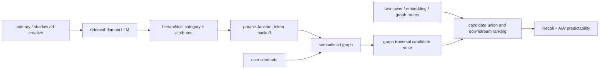

# LLM Retrieval：稳定、可预测的广告语义召回

> **Fidelity: 核心机制复现**。本地实际执行成对 creative 的领域 SFT、LLM hidden-state 属性头、层级离散语义表示、phrase→token 两级 Jaccard 建图、协同图融合、validation 选权重，以及扰动稳定性评估；未复刻 Meta 私有广告语料、Llama-3-8B、分布式推理、线上转换与 shadow-ad 流量系统。

- 论文：[arXiv 2605.21969](https://arxiv.org/abs/2605.21969)，Meta
- Adapter：`llm-ad-retrieval`；代码：`src/auto_research/reproductions/llm_ad_retrieval/`
- 本地数据：MovieLens-100K；运行：`auto-research reproduce --paper llm-ad-retrieval --seed 42`

## 原始论文总结

### 背景与主要改动

广告候选生成通常只优化点击/转化预测与 Recall，轻微修改 creative 后却可能因为 ID 或稀疏特征变化而得到完全不同的投放结果。论文新增 A/A' predictability 框架：复制 primary ad 为 shadow ad，只做不改变语义的输入扰动，再衡量两者转换和曝光差异。模型侧用经过广告检索任务适配的 LLM 从标题、描述等 creative 中抽取层级 category、brand、product 和 context 属性；先按类别粗召回，再按更深属性重排并构建 ad-to-ad 语义图，最后从用户 seed ads 做图扩展。



### 核心公式

对 primary/shadow 广告转换相对差异 $\Delta$，论文定义 90% 置信区间外的显著差异：

$$StatSigDiff(ad^p,ad^s)=\max\left(0,\Delta-1.65\sqrt{\frac{2}{conv(ad^p)+conv(ad^s)}}\right).$$

系统级指标再按广告收入平方根加权：

$$StatSigDiff=\frac{\sum_i StatSigDiff(ad_i^p,ad_i^s)\sqrt{rev(ad_i^p)+rev(ad_i^s)}}{\sum_i\sqrt{rev(ad_i^p)+rev(ad_i^s)}}.$$

语义图先比较短语集合；低于阈值时回退到 token 集合：

$$S_R(Ad_1,Ad_2)=\begin{cases}J(P_1,P_2),&J(P_1,P_2)\ge\theta\\J(T_1,T_2),&\text{otherwise}\end{cases}.$$

带置信度的共同类别还可按点积聚合：

$$S_R(Ad_1,Ad_2)=\sum_{c\in C_1\cap C_2}s_{1,c}s_{2,c}.$$

### 论文离线与线上效果

论文用开源 Llama-3-8B-Instruct 对数千万条纯文本广告做推理；控制组是 Two-tower、embedding 与 graph candidate generators 的生产 ensemble，实验组只新增 LLM semantic route，其他投放链路不变。

| Metric | Paper result |
|---|---:|
| Online top-line performance | **+0.45%**，统计显著 |
| Final-stage recall | **+1.2%** |
| A/A' StatSigDiff | **-8.62%** |
| Daily impression-difference MAD | **+45% improvement** |
| Incremental recall potential, Top-200 vs Top-5 | 1.89× vs 1.00× |

## 本地复现

MovieLens-100K 的标题/类型充当公开 creative，评分 ≥4 的时序行为充当 seed 与 held-out relevant item。选择交互最频繁的 180 个物品和 150 个用户；每个用户最后两个物品分别为 validation/test。对标题年份只改变标点和表达，构造不改变语义的 shadow creative。

SmolLM2-135M-Instruct 在前 80% 商品的 primary/shadow 对上做 80-step domain SFT，同一对共享 taxonomy target；随后在 LLM hidden state 上训练 160-step 多标签 attribute head。协同 item graph 是生产 ensemble 的公开代理，LLM graph 权重只在 validation 的 $\{0,0.25,0.5,1,2\}$ 中选择，test 使用固定 K=20 候选预算。

```bash
for seed in 42 43 44; do
  AUTO_RESEARCH_LLM_AD_USERS=150 \
  AUTO_RESEARCH_LLM_AD_ITEMS=180 \
  AUTO_RESEARCH_LLM_AD_K=20 \
  AUTO_RESEARCH_LLM_AD_TUNING_STEPS=80 \
  auto-research reproduce --paper llm-ad-retrieval --seed "$seed"
done
```

| Route | Recall@20 | NDCG@20 |
|---|---:|---:|
| Collaborative item graph | 0.2800 | 0.11438 |
| + LLM semantic graph | **0.3133** | **0.11785** |
| Relative change | **+11.90%** | **+3.03%** |

| Stability proxy | Lexical graph | LLM semantic graph |
|---|---:|---:|
| Primary/shadow neighbor Jaccard@20 ↑ | 0.5464 | **0.7419** |
| Mean edge-score difference ↓ | 0.04282 | **0.00970** |

三次 tie-breaking seed 42/43/44 结果完全一致；该链路没有实际 score tie，因此不把 `±0` 伪装成随机训练方差。SFT loss 从 0.46820 降到 0.000365，attribute head 从 0.66460 降到 0.01467，primary/shadow 属性集合完全一致率 93.89%。语义图使边分数漂移下降 **77.36%**，同时在固定候选预算下提升召回，支持论文两个核心方向。

本地结果不等价于广告线上 A/B：MovieLens genre 比自由广告文本更结构化，没有 conversion/revenue，也无法计算论文的收入加权 StatSigDiff；SmolLM2 和轻量属性头也不能代表 Llama-3-8B 或 Meta 数千万广告规模。模型 checkpoint、属性缓存和原始 runs 只保存在本地。结构化指标见 [`metrics/movielens-100k-seeds42-44.json`](metrics/movielens-100k-seeds42-44.json)。
