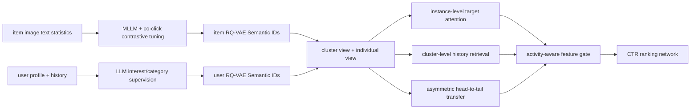

# AKT-Rec：用 LLM Semantic ID 做非对称长尾知识迁移

> **Fidelity: 核心机制复现**。本地对真实 SmolLM2-135M 注入 LoRA，实际执行物品共现对比微调、用户兴趣/类别监督、残差 Semantic ID、cluster/individual 双视图、head-to-tail 非对称 stop-gradient、正交约束与两级活动度门控。

## 论文信息

| 项目 | 内容 |
| --- | --- |
| 论文链接 | [arXiv 2605.23310](https://arxiv.org/abs/2605.23310) |
| 公司/机构 | Alibaba Group / Peking University |
| 首次公开日期 | 2026-05-22（arXiv v1） |
| 原文开源代码 | 否：论文未提供官方/作者代码（核查日期：2026-07-22） |
| Adapter | `akt-rec` |
| 本地复现代码 | [`src/auto_research/reproductions/akt_rec/`](https://github.com/daiwk/auto-research/tree/main/src/auto_research/reproductions/akt_rec/) |

## 原始论文总结

### 背景与主要改动

工业推荐的用户与物品都呈强长尾分布。直接共享表示可能把尾部稀疏且噪声较大的信号反向传给头部，普通对称对比学习因此不一定安全。AKT-Rec 先用 MLLM 对齐内容和协同信号，再用 RQ-VAE 把用户、物品量化成层级 Semantic ID，以同一高层 ID 定义语义簇。

排序阶段为每个 ID 同时学习 cluster view 和 individual view。非对称 InfoNCE 对 tail→head 方向赋更大权重，并在作为 teacher 的一侧 stop-gradient；活动度门控决定共享簇知识和个体知识的比例。模型再分别构造实例级与簇级历史，通过第二个活动度门控融合后预测 CTR。



### 核心公式

RQ-VAE 的逐层残差量化为：

$$
id_k=\arg\min_i\lVert r_{k-1}-e_i\rVert_2^2,\qquad
r_k=r_{k-1}-e_{id_k}.
$$

非对称迁移中，tail 更新方向的权重更大：

$$
\mathcal L_{trans}=\lambda_1\mathcal L_{info}(c^{head},\operatorname{sg}(c^{tail}))
+\lambda_2\mathcal L_{info}(c^{tail},\operatorname{sg}(c^{head})),
\qquad \lambda_1<\lambda_2.
$$

cluster 与 individual view 使用软正交约束：

$$
\mathcal L_{ortho}=\left(\frac{c_i^Td_i}{\lVert c_i\rVert_2\lVert d_i\rVert_2}\right)^2.
$$

活动度控制 embedding 融合与层级 feature 融合：

$$
e_i=r_i c_i+(1-r_i)d_i,\qquad r_i=G_1(f_i^{act}),
$$

$$
f=\alpha H_{clust}+(1-\alpha)H_{inst},\qquad
\alpha=G_2([f_u^{act};f_i^{act};f_{cross}^{act}]).
$$

### 论文离线与线上效果

Tmall 私有数据上，online base 的 AUC/GAUC 为 `0.7510/0.6385`，AKT-Rec 为 `0.7536/0.6483`；论文给出的相对提升为 AUC `+0.346%`、GAUC `+1.53%`，且长尾样本受益更明显。

两周线上 A/B 中 control 与 treatment 各 10% 流量：Clicks `+2.73%`、CTR `+2.76%`、CTCVR `+1.70%`、GMV `+3.47%`。

## 本地复现

> **本地对照口径**：基线是只使用 individual embedding 和实例级 target attention 的 `online_base`；实验组 `akt_rec` 在同一 sampled-CTR 数据、初始化和训练预算上加入 LLM Semantic ID、cluster view、非对称迁移、正交约束及两级门控。三随机种子 test AUC `0.45600→0.47170`（**+3.44%**）、GAUC `0.45208→0.47708`（**+5.53%**）、tail AUC `0.50854→0.51949`（**+2.15%**）。

公开 MovieLens-100K 的标题/genre 替换商品图片、描述和工业统计特征。SmolLM2-135M 先以相邻正反馈电影做 InfoNCE，再用用户历史预测未来兴趣向量与类别；不是预计算静态 embedding。CTR 样本对每个正例固定构造一个流行度采样负例，tail 定义为训练正反馈少于 10 次。

| Test variant | AUC | GAUC | Tail AUC |
|---|---:|---:|---:|
| online_base | 0.45600 ± 0.02721 | 0.45208 ± 0.01881 | 0.50854 ± 0.03504 |
| AKT-Rec | **0.47170 ± 0.02199** | **0.47708 ± 0.01031** | **0.51949 ± 0.02081** |

validation 也保持同向：AUC `0.47915→0.48472`、GAUC `0.46458→0.47083`。绝对 AUC 偏低，是因为负例按流行度采样，常比 held-out 正例更热门；两组严格共享相同负例，因此这里只解释同协议相对变化。

LLM 阶段实际训练 `230,400` 个 LoRA 参数；用户监督目标从 `3.3054` 降至 `2.1680`。RQ-VAE 先做 40 步 autoencoder 预训练与逐层 k-means 初始化，再做 100 步 straight-through 量化；最终 1,682 个物品形成 470 个三层 code，320 个用户形成 75 个两层 code，避免了早期实验的 codebook collapse。

```bash
AUTO_RESEARCH_AKT_ITEM_STEPS=30 \
AUTO_RESEARCH_AKT_USER_STEPS=30 \
AUTO_RESEARCH_AKT_STEPS=400 \
AUTO_RESEARCH_AKT_SEEDS=3 \
auto-research reproduce --paper akt-rec --seed 42
```

稳定指标见 [`metrics/movielens-100k-seeds42-44.json`](metrics/movielens-100k-seeds42-44.json)。checkpoint 与原始 runs 不提交。

## 复现边界

- 真实训练开源 causal LM 的 LoRA，并分别执行物品协同对齐和用户监督；没有用哈希或静态文本向量替代这两步。
- 原论文 GME-Qwen2-VL-7B、Qwen3-30B-A3B、商品图片和统计特征缩为 SmolLM2-135M 与 MovieLens 文本/genre。
- 本地 residual quantization 保留三层 item code 和两层 user code；工业 RQ-VAE 规模与私有 co-occurrence 数据不可获得。
- 未实现 Tmall 的 cluster feature store 和线上 MMoE serving；不声称复现论文延迟或线上收益。
