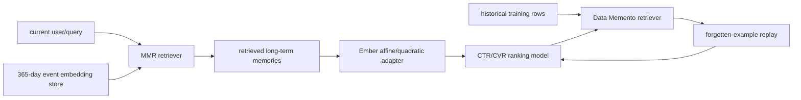

# Memento: RAG-style long-retention recommendation

- 论文：[arXiv 2605.24051](https://arxiv.org/abs/2605.24051)，Meta
- Adapter：`memento`；代码：`src/auto_research/reproductions/memento/`
- 本地数据：MovieLens-100K；运行：`auto-research reproduce --paper memento --seed 42`

## 原始论文总结

### 背景与主要改动

工业推荐模型通常只保留有限长度历史，长期但相关的行为被截断；训练数据也会因一次 SGD 后被“忘记”。Memento 将 RAG 思想分成两条路径：Representation Memento 从最长 365 天用户历史 embedding 库检索与当前 query 相关且互不冗余的事件，再用 Ember 条件变换融入主模型；Data Memento 从历史训练样本库检索被当前模型遗忘、但与当前 batch 有关的样本做第二次 replay。

### 核心公式

Representation Memento 用 maximal marginal relevance 兼顾 query 相关性和结果多样性：

$$d^*=\arg\max_{d\in D\setminus S}\left[\lambda\,sim(d,q)-(1-\lambda)\max_{s\in S}sim(d,s)\right].$$

Ember Affine 对检索表示做条件缩放和平移：

$$e'(x;c)=\gamma(c)\odot e(x)+\beta(c).$$

Ember Quadratic 进一步加入乘性交互：

$$\Psi(X^h)=X^h\odot ReLU(W_a^hX)+X^h.$$

### 论文离线与在线效果

内部训练约 500 亿样本，在随后 10 亿样本评估；原始事件最长约 190K、embedding 历史最长约 20K。Representation Memento 的归一化熵（越低越好）如下：

| Variant | CTR NE | CVR NE |
|---|---:|---:|
| LITE | -0.05% | -0.08% |
| Retrieval V1 | -0.20% | -0.17% |
| Ember Affine | -0.22% | -0.23% |
| Ember Quadratic | -0.22% | -0.26% |
| Affine + Quadratic | **-0.25%** | **-0.26%** |

Data Memento 的主要离线改善从 MP -0.107%、RAND25-RS -0.120%、MMR25-ES -0.155% 到 MMR25-RS **-0.195%**。线上多轮 A/B 报告 Facebook Feed/Reels CTR **+1.0%**、Offsite Conversion CVR **+1.2%**，额外延迟低于 10ms，推理 QPS 变化低于 5% 且不显著。

## 本地复现

实现 Representation Memento 的 query-conditioned MMR，validation 在 $\lambda\in\{0.3,0.5,0.7,0.9\}$ 中选择，与 LastN 对照；MovieLens 评分 ≥4、leave-two-out、full catalog。

| History method | Hit@10 | NDCG@10 | Head share@10 |
|---|---:|---:|---:|
| LastN | 0.0901 | 0.0443 | 0.2979 |
| Memento MMR | **0.0966** | **0.0464** | 0.3093 |

NDCG@10 **+4.78%**，最佳 $\lambda=0.30$，表明多样性惩罚有用。原论文数据和 serving 系统均为 Meta 内部资源，所以继续使用公开 proxy；未复现 Ember、INT8 检索服务与 Data Memento replay。
