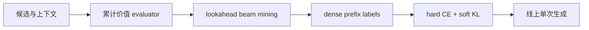

# DeGRe：离线前瞻蒸馏的生成式重排

> **Fidelity: 核心机制复现**。累计价值评估器、lookahead beam mining、逐前缀 dense label、beam weighting 与单次在线生成路径均实际执行。

## 论文信息

| 项目 | 内容 |
| --- | --- |
| 论文链接 | [arXiv 2605.25749](https://arxiv.org/abs/2605.25749) |
| 公司/机构 | Alibaba Group / Zhejiang University |
| 首次公开日期 | 2026-05-25（arXiv v1） |
| 原文开源代码 | 否：论文未提供官方/作者代码（核查日期：2026-07-22） |
| Adapter | `degre` |
| 本地复现代码 | [`src/auto_research/reproductions/degre/`](https://github.com/daiwk/auto-research/tree/main/src/auto_research/reproductions/degre/) |

## 原始论文总结

### 背景与主要改动

逐点生成器只学习日志中的单一路径，难以直接优化整张列表的长期价值。DeGRe 离线训练累计回报 evaluator，用 beam search 探索高价值列表，再把每个前缀下所有剩余候选的前瞻价值蒸馏为 dense soft label；线上只保留一次 greedy generator。



### 核心公式

$$
q_t(v_i)=\frac{\exp \hat V([l_{<t};v_i])}{\sum_{v_j\notin l_{<t}}\exp \hat V([l_{<t};v_j])},\qquad w_l=\operatorname{softmax}(\hat V(l)/\tau_w).
$$

$$
\mathcal L=\sum_lw_l\sum_t\left[\operatorname{CE}(y_t,p_t)+\alpha\operatorname{KL}(q_t\|p_t)\right].
$$

### 论文离线与线上效果

Taobao Flash Shopping 8 天、2% 流量 A/B：CTR `+2.85%`、订单 `+2.14%`、GMV `+3.75%`；论文还报告 Alipay GMV `+4.14%`。

## 本地复现

> **本地对照口径**：基线是相同候选与特征的 pointwise generator；实验组 DeGRe 加入离线前瞻蒸馏，相对基线 Hit@10 `+0.00%`、NDCG@10 **`+3.31%`**。

MovieLens-100K 220 用户、360 物品；交易价值由正反馈、列表多样性和 novelty 组成公开代理。稳定指标见 [`metrics/movielens-100k-seed42.json`](metrics/movielens-100k-seed42.json)。

```bash
auto-research reproduce --paper degre --seed 42
```

## 复现边界

未复刻私有交易标签与工业 Transformer 规模；本地结果仅验证离线 evaluator→beam mining→dense distillation 链路。
