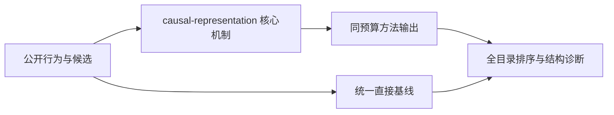
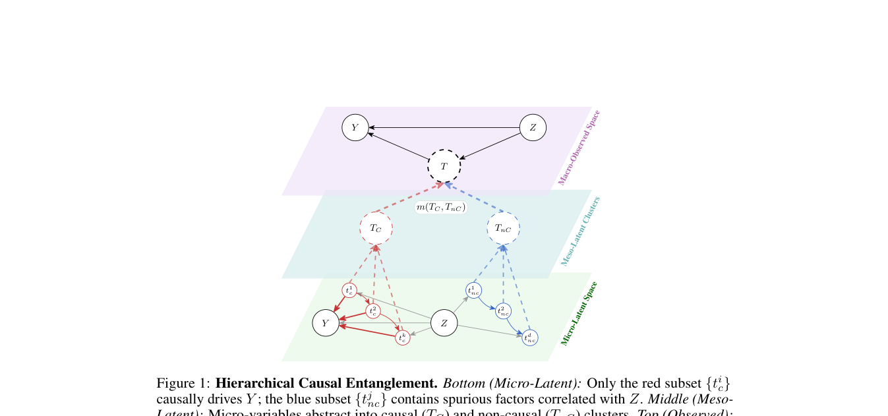

# 因果表征学习：面向分布偏移的可泛化推荐

> **Fidelity: 核心机制复现**。本地代码执行论文最有辨识度、可由公开数据验证的机制；私有数据、生产模型与服务栈明确列为边界。

## 论文信息

| 项目 | 内容 |
| --- | --- |
| 论文链接 | [arXiv 2605.27043](https://arxiv.org/abs/2605.27043) |
| 公司/机构 | University of Warwick（按第一作者所属机构聚合） |
| 首次公开日期 | 2026-05-26（arXiv v1） |
| 原文开源代码 | 否：未找到原作者公开代码（核查日期：2026-09-02） |
| Adapter | `causal-representation` |
| 本地复现代码 | [`src/auto_research/reproductions/causal_representation/`](https://github.com/daiwk/auto-research/tree/main/src/auto_research/reproductions/causal_representation/) |

## 原始论文总结

### 背景与主要改动

通过信息论去混杂约束，让候选表征保留与结果有关的因果成分、丢弃由曝光策略带来的非因果成分；训练后不增加线上推理开销。



<!-- paper-figure:start -->
### 原论文关键图

[](https://arxiv.org/pdf/2605.27043#page=3)

> **原论文 Figure 1（关键图）**：展示原论文方法的总体设计和关键组成。图片来自[原论文](https://arxiv.org/abs/2605.27043)，版权归原作者所有；点击图片可查看来源。
<!-- paper-figure:end -->

### 核心公式

$$
J(g)=I(g(T);Y\\mid Z)-\\lambda I(g(T);Z).
$$

### 论文离线与线上效果

- Spotify 数百万用户、两周线上实验：Track Streams +0.75%、Skips -0.61%、Minutes Played +0.50%，均达到 95% 显著性。
- 上述数字只复述论文线上证据，不写入本地公开数据效果结论。

## 本地复现

> **本地对照口径**：同一 MovieLens 全目录协议下，基线 NDCG@10 为 `0.05401`，实验组为 `0.05220`，相对变化 **-3.35%**。本地代理目标与论文生产任务不同，不能外推线上 lift。

三随机种子完整结果、均值、标准差与 95% CI：

- [`metrics/public-seeds42-44.json`](metrics/public-seeds42-44.json)

```bash
auto-research reproduce --paper causal-representation --dataset-dir data --seeds 42,43,44
```

## 复现边界

本地使用 MovieLens-1M 的公开子集及可审计代理目标，只验证中心计算机制；不复现原论文的私有日志、生产基础模型、线上分桶和 serving 栈。因此本页不宣称复现原文绝对指标或线上增益。
