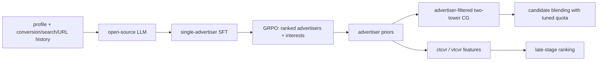

# Fine-Tuned LLM as a Complementary Predictor Improving Ads System

> **Fidelity: 完整核心链路**。本地实际执行开源 causal LLM 的 LoRA SFT、论文位置/格式 reward 驱动的 clipped GRPO、受约束 advertiser 解码、训练式 two-tower、validation 配额选择的补充召回，以及 LLM advertiser score 作为排序特征。Pinterest 私有广告与跨站转化数据由公开商品品牌和购买序列替换。

## 论文信息

| 项目 | 内容 |
| --- | --- |
| 论文链接 | [arXiv 2605.27856](https://arxiv.org/abs/2605.27856) |
| 公司/机构 | Pinterest |
| 首次公开日期 | 2026-05-27（arXiv v1） |
| 原文开源代码 | 否：论文未提供官方/作者代码（核查日期：2026-07-15） |
| Adapter | `pinterest-ads-llm` |
| 本地复现代码 | [`src/auto_research/reproductions/pinterest_ads_llm/`](https://github.com/daiwk/auto-research/tree/main/src/auto_research/reproductions/pinterest_ads_llm/) |

## 原始论文总结

### 背景与主要改动

论文没有让 LLM 替换广告召回或排序，而是把它作为 ancillary predictor：输入用户画像、历史转化、搜索、URL、品类和品牌，预测下一批高转化意图 advertiser 与兴趣。预测结果一方面成为 advertiser 定向的补充召回通道，另一方面作为 ctcvr/vtcvr 特征进入后续排序。

训练分三层：先用单一 next-advertiser 标签做 SFT；再用 GRPO 生成 20 个 advertiser 与 5 个兴趣，并用命中位置和严格输出长度计算 reward；扩展版本还将五级 PinCLIP/RQ-VAE SID 经三阶段 CPT/SFT 注入 LLM。线上 serving 使用 vLLM+Ray 做每日批推理，不把 LLM 放在请求实时路径。



### 核心公式

SFT 对下一 advertiser 文本 $a^+$ 优化自回归负对数似然：

$$
\mathcal L_{SFT}=-\sum_t\log p_\theta(a_t^+\mid x,a_{<t}^+).
$$

GRPO 的总 reward 为：

$$
R=R_{match}-P_{adv\_len}-P_{interest\_len},
$$

$$
R_{match}(i)=0.1(20-i)+2\cdot\mathbf 1[i\le4],
$$

$$
P_{len}(n,n^*)=\begin{cases}0,&n=n^*\\
\min(0.1|n-n^*|,1)+1,&n\ne n^*.\end{cases}
$$

本地按同一公式缩放为 5-advertiser group，并以组内标准化 advantage 执行两轮 clipped ratio 更新。补充召回将预测 advertiser 集合 $A_u$ 作为过滤器：

$$
\mathcal C_{LLM}(u)=\operatorname{TopK}_{i:a_i\in A_u}s_{2tower}(u,i),
$$

再用 validation 选择固定 quota 与常规候选混排；排序侧把 advertiser log-prob 作为额外特征。

### 论文离线与线上效果

| Paper V1 variant | Recall@1 | Recall@5 | Recall@20 |
|---|---:|---:|---:|
| Zero-shot | 0.117 | 0.301 | 0.422 |
| SFT (1 advertiser) | 0.214 | 0.413 | 0.501 |
| SFT + GRPO | 0.223 | 0.461 | 0.683 |
| SID-enabled SFT + GRPO | **0.248** | **0.515** | **0.755** |

排序侧加入 LLM 特征后，论文报告 ctcvr AUC `+0.06%`、vtcvr AUC `+0.09%`。美国 Shopping Ads 线上结果：

| Online A/B | RoAS | Significance |
|---|---:|---:|
| US Shopping slice | +4.94% | p=0.021 |
| Opt-in US Shopping slice | +6.69% | p=0.029 |

## 本地复现

> **本地对照口径**：基线是同一 SmolLM2-135M、同一公开 advertiser 集合下的 `SFT`；实验组在该 checkpoint 上继续执行论文 reward 的 `SFT+GRPO`，测试 Recall@20 相对变化 **0.00%**（两者均为 0.1250，validation 选择 SFT）。下游另以 two-tower 为基线：LLM 排序特征使 sampled AUC 从 0.62613 到 0.64232（**+2.59%**），但 validation 将 LLM 补充召回 quota 选为 0，因此 Recall@50 仍为 0.1250。不同对照不混写，也不是论文线上 A/B。

使用 12,000 条训练样本、48 个高频 advertiser、32 validation / 32 test 用户。SFT 48 steps、GRPO 16 steps、two-tower 160 steps；完整商品目录用于 two-tower 召回，排序 AUC 每请求使用 1 正例和 19 个固定随机负例。

| Local advertiser predictor | Recall@1 | Recall@5 | Recall@20 | Mean rank |
|---|---:|---:|---:|---:|
| SFT（validation 选中） | 0.0625 | 0.0625 | 0.1250 | 36.5625 |
| SFT + GRPO | 0.0625 | 0.0625 | 0.1250 | **34.6250** |

GRPO 没提高 Recall@20，但 mean rank 改善 5.30%；validation Recall@20 从 0.1875 降至 0.1250，所以不能用 test mean rank 反向改选。补充召回的最优 quota 为 0，说明当前 advertiser predictor 不足以安全替换常规 two-tower 候选；排序特征有小幅正信号。

```bash
AUTO_RESEARCH_PIN_ADS_SFT_STEPS=48 \
AUTO_RESEARCH_PIN_ADS_GRPO_STEPS=16 \
AUTO_RESEARCH_PIN_ADS_TOWER_STEPS=160 \
AUTO_RESEARCH_PIN_ADS_EVAL_USERS=32 \
auto-research reproduce --paper pinterest-ads-llm --seed 42
```

稳定指标见 [`metrics/office-seed42.json`](metrics/office-seed42.json)。模型、checkpoint、数据和原始 `runs/` 不提交 Git。

## 复现边界

- 使用真实预训练语言模型和可训练 LoRA，不是规则或 embedding 打分替代 SFT/GRPO。
- Amazon brand、title、购买序列替换 Pinterest advertiser、URL、跨站 conversion、用户画像和广告花费；这会显著削弱世界知识与商业意图信号。
- 本地 group/list 从论文 20 advertiser 缩为 5，模型从 4B 缩为 135M；reward、组内 advantage 和 clipped update 保留。
- 未运行 Pinterest 私有 PinCLIP SID 三阶段 CPT，也不声称本地 AUC/Recall 可外推 RoAS。
