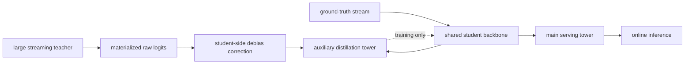

# Rec-Distill: Industrial teacher-to-serving-student transfer

> **Fidelity: 完整核心链路复现**。本地实际训练大 teacher 与轻 student，物化 black-box logits，执行 student-side sampling correction、main/aux decoupled towers、batch→streaming 两阶段蒸馏，并在 validation 搜索 loss ratio。

- 论文：[arXiv 2605.29755](https://arxiv.org/abs/2605.29755)，ByteDance / Douyin / TikTok
- Adapter：`rec-distill`

## 原始论文总结

### 背景与主要改动

工业大推荐 teacher 无法直接 serving，且 teacher/student 数据采样与实时分布不同。Rec-Distill 让 teacher 在自身 forward 阶段写出黑盒 logits，一份信号可异步服务多个 student。Student 的 main tower 只收真实标签并用于线上；aux tower 同时收 task 与 distillation loss，两者共享 backbone。Teacher raw logits 先使用 student 的 sampling correction 投影到同一概率空间，再蒸馏。训练先 batch 收敛，再持续消费 streaming teacher signals。



### 核心公式

$$\eta=\frac{P_S^{distill}-P_S^{raw}}{P_T-P_S^{raw}},$$

$$\mathcal L_{aux}=\mathcal L_{task}+\alpha\mathcal L_{distill},$$

$$\hat y=\frac{1}{1+\frac{r_s}{p_X}(e^{-z}+1-r_++b_s)},\qquad T'_2=f_S(T_1).$$

### 论文离线与线上效果

论文 24B→1B 仍达到 65% transferability；batch/stream 和 decoupled tower 消融均为正。线上 Ads ADVV `+1.00%`、推荐 Finish/U `+1.2725%`、TikTok Live gift revenue `+0.78%`。

## 本地复现

> **本地对照口径**：迁移基线是相同日程训练的 Raw Student；实验组是 Rec-Distill Student；NDCG@10 从 0.0039 降至 0.0036，transferability **-4.11%**。Large Teacher 只用于确认 teacher gain，不是 serving baseline，也不能把较低 head share 当作蒸馏提升。

MovieLens-100K 上 96d/3-layer teacher 对比 48d/1-layer student。物化 12,000 行、16 candidates 的 teacher logits（0.384 MB）；student 使用相同 160 batch + 80 stream 日程。`α∈{0.1,0.3,1,3}` 只看 validation，选中 `α=3` 后报告 test。

| Model | Hit@10 | NDCG@10 | Head share@10 |
|---|---:|---:|---:|
| Large teacher | **0.0247** | **0.0121** | 0.5145 |
| Raw matched-schedule student | 0.0086 | 0.0039 | 0.2716 |
| Rec-Distill student | 0.0075 | 0.0036 | **0.2576** |

Teacher gain 明确存在，但 distilled student 略低于 raw student，transferability 为 **-4.11%**。这说明小数据上的 black-box corrected logits 没有成功迁移 teacher gain；validation 随 α 增大略升，但未转化到 test。该负结果不会用“更低 head share”包装成蒸馏有效。

结构化指标：[metrics/movielens-100k-seed42.json](metrics/movielens-100k-seed42.json)。

```bash
auto-research reproduce --paper rec-distill --dataset-dir data --seed 42
```

teacher signals、模型和运行结果只保存在被 Git 忽略的 `runs/`。
