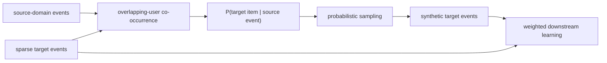
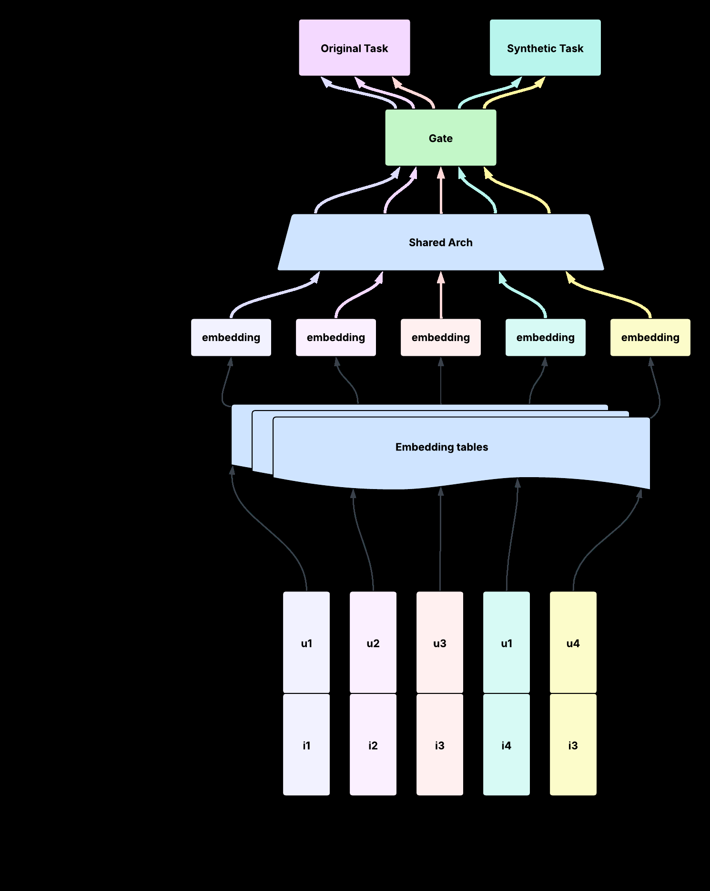

# SCALR：把跨域行为翻译成推荐训练数据

> **Fidelity: 核心机制复现**。本地从重叠用户估计跨域 item translation distribution，真实生成随机采样与 deterministic top-k 两套 synthetic events，再用相同下游协议比较。

## 论文信息

| 项目 | 内容 |
| --- | --- |
| 论文链接 | [arXiv 2606.00282](https://arxiv.org/abs/2606.00282) |
| 公司/机构 | Meta |
| 首次公开日期 | 2026-05-29（arXiv v1） |
| 原文开源代码 | 否：论文与 arXiv 页面未提供官方/作者实现（核查日期：2026-09-01） |
| Adapter | `scalr` |
| 本地复现代码 | [`src/auto_research/reproductions/scalr/`](https://github.com/daiwk/auto-research/tree/main/src/auto_research/reproductions/scalr/) |

## 原始论文总结

### 背景与主要改动

目标域 conversion 极稀疏，而同一用户在其他产品 surface 上有丰富行为。传统 cross-domain recommendation 把迁移逻辑耦合进模型参数；SCALR 先把 source event 翻译成目标域格式的 synthetic user-item event，再让任何下游模型像读取普通目标域数据一样训练。随机采样保留概率分布和 catalog 多样性，避免 top-k 反复生成少数头部 item。



<!-- paper-figure:start -->
### 原论文关键图

[](https://arxiv.org/html/2606.00282v1/SynRec_crossdomain.png)

> **原论文 Figure 3（关键图）**：展示原论文提出的核心架构、主要模块及其连接关系。图片来自[原论文](https://arxiv.org/abs/2606.00282)，版权归原作者所有；点击图片可查看来源。
<!-- paper-figure:end -->

### 核心公式

对 source item $j$ 与 target item $i$，重叠用户给出频率估计：

$$
\hat P(i\mid j)=\frac{\sum_{u\in U_{overlap}}\mathbf 1[(u,j)\in D_S]\mathbf 1[(u,i)\in D_T]}{\sum_{u\in U_{overlap}}\mathbf 1[(u,j)\in D_S]}.
$$

每个 source event 不取单一 argmax，而是执行 $i_k\sim\hat P(\cdot\mid u,j)$，再将 $(u,i_k,w_k)$ 加入目标域训练集。

### 论文离线与线上效果

- 线上实验在 live traffic 上运行多周，主要模型 CVR 持续提升约 `0.14%～0.24%`，论文说明结果具有统计显著性。
- 论文消融指出概率采样优于 deterministic top-k；synthetic 数量需要饱和控制，且分布对齐会影响下游效果。

## 本地复现

> **本地对照口径**：基线为相同 source events、相同每事件生成预算的 deterministic top-k translation，实验组改为 SCALR 概率采样；seed 42 的 NDCG@10 相对 `-10.25%`，但生成 catalog coverage 从 `2.5%` 提升到 `100%`。

MovieLens genre 作为互斥 source/target 子域代理。小数据上概率采样扩大覆盖、降低 head share，却没有重现私有 conversion 场景的排序 lift；该负结果保留在三 seed 产物中：

- [`metrics/public-seeds42-44.json`](metrics/public-seeds42-44.json)：三随机种子逐次结果、均值、标准差与 95% CI。

```bash
auto-research reproduce --paper scalr --dataset-dir data --seed 42
```

## 复现边界

本地 genre 不是 Meta 的跨产品 surface，也没有 conversion label、隐私管线或多源生产生成服务。结果只验证概率翻译、随机生成和分布覆盖机制，不能外推论文线上 CVR。
