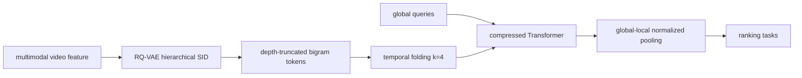
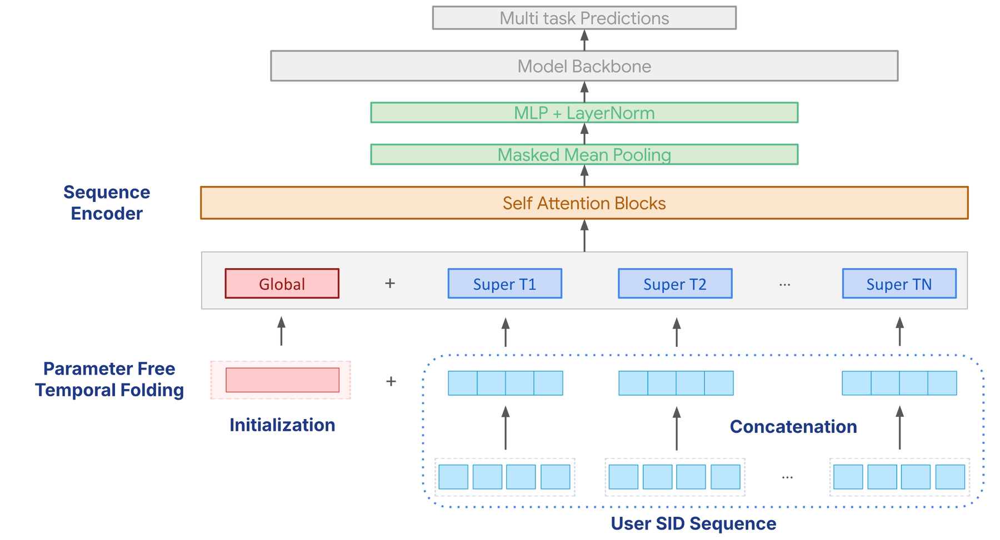

# Semantic-Native Long Sequence：SID 与全局感知压缩 Transformer

> **Fidelity: 核心机制复现**。本地实际构建 residual-quantized Semantic ID，执行 depth-truncated bigram、parameter-free temporal folding、global query attention 和 global-local pooling。

## 论文信息

| 项目 | 内容 |
| --- | --- |
| 论文链接 | [SIGIR 2026 / arXiv 2606.07546](https://arxiv.org/abs/2606.07546) |
| 公司/机构 | Google |
| 首次公开日期 | 2026-05-04（arXiv v1） |
| 原文开源代码 | 否：论文与 arXiv 页面未提供官方/作者实现（核查日期：2026-09-01） |
| Adapter | `semantic-native-longseq` |
| 本地复现代码 | [`src/auto_research/reproductions/semantic_native_longseq/`](https://github.com/daiwk/auto-research/tree/main/src/auto_research/reproductions/semantic_native_longseq/) |

## 原始论文总结

### 背景与主要改动

原子 Video ID 只能记忆内容，embedding table 随 corpus 无界增长，新视频也没有可迁移语义；完整 attention 又让千级历史成本呈平方增长。论文先用 RQ-VAE 产生 coarse-to-fine SID，并截断为 bounded bigram vocabulary；再把相邻 $k$ 个事件无参数折叠为 super-token，同时加入统一 global query，使模型在保留全局兴趣的情况下处理更长历史。



<!-- paper-figure:start -->
### 原论文关键图

[](https://arxiv.org/html/2606.07546v1/2026sigir.png)

> **原论文 Figure 2（关键图）**：展示原论文方法的总体设计和关键组成。图片来自[原论文](https://arxiv.org/abs/2606.07546)，版权归原作者所有；点击图片可查看来源。
<!-- paper-figure:end -->

### 核心公式

窗口折叠将长度 $L$ 变为 $L'=L/k$，论文把每个窗口特征沿 channel 维重组；本地以确定性的 mean/recent 组合保留相同“时间分辨率换特征表达”原则。最终用户向量为：

$$
u_{final}=\frac{\sum_{j=1}^{L'+N_g}H_{out}[j]M'_j}{\sum_{j=1}^{L'+N_g}M'_j+\epsilon}.
$$

其中前 $N_g$ 个位置是始终有效的 global queries，其他位置是折叠后的局部历史。

### 论文离线与线上效果

- SID 相对 Video ID 的 Freshness satisfied views 提升 `6.81%`。
- $L=800,k=4$ 时训练 step 从 `41.1ms` 降到 `6.6ms`（`-83.9%`），peak HBM 从 `5758MiB` 降到 `448MiB`（`-92.2%`）。
- 完整系统把线上序列从 800 Video IDs 扩至 2,000 SIDs：Actively Engaged Users `+0.52%`、Satisfied Watch Time `+1.42%`、Satisfied Views `+1.08%`，均 `p<0.05`。

## 本地复现

> **本地对照口径**：基线在相同公开切分上使用 12-event item-ID feature attention，实验组将 48-event SID 历史按 4 折叠为 12 个局部 token 并加入两个 global queries；seed 42 的 NDCG@10 相对 `+25.42%`。

本地 attention token 数为 14，相对直接对 48 个事件做 full attention，pair 数 proxy 减少约 `91.49%`。三 seed 同时保留 SID 聚类方差：

- [`metrics/public-seeds42-44.json`](metrics/public-seeds42-44.json)：三随机种子逐次结果、均值、标准差与 95% CI。

```bash
auto-research reproduce --paper semantic-native-longseq --dataset-dir data --seed 42
```

## 复现边界

MovieLens feature 只代理多模态视频表征；本地未训练 Google RQ-VAE，没有 billion-user 私有流量、2,000-event 服务序列、异步长历史模块或定制 HBM kernel。公开结果不能与论文线上业务指标直接比较。
