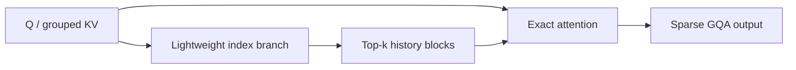

# MiniMax Sparse Attention：面向超长上下文的块稀疏 GQA

> **复现保真度：核心机制复现。** Index branch、每 GQA 组 top-k block 和精确 sparse attention 均真实训练；109B 预训练与 fused kernel 未复刻。

## 论文信息

| 项目 | 内容 |
| --- | --- |
| 论文链接 | [arXiv 2606.13392](https://arxiv.org/abs/2606.13392) |
| 公司/机构 | MiniMax |
| 首次公开日期 | 2026-06-11（arXiv v1） |
| 原文开源代码 | 是：[官方/作者代码](https://github.com/MiniMax-AI/MSA) |
| Adapter | `minimax-sparse-attention` |
| 本地复现代码 | [`src/auto_research/reproductions/minimax_sparse_attention/`](https://github.com/daiwk/auto-research/tree/main/src/auto_research/reproductions/minimax_sparse_attention/) |

## 原始论文总结

### 背景与主要改动

长上下文 dense attention 的二次复杂度成为主要瓶颈。MSA 为每个 GQA 组增加轻量 index branch，先选择少数历史 block，主分支再对命中 token 做精确 attention；训练和推理使用同一路径。



### 核心公式

$$
\mathcal B_q=\operatorname{TopK}_b\langle q_I,\bar k_{I,b}\rangle,\qquad
\operatorname{MSA}(q)=\sum_{j:\,b(j)\in\mathcal B_q}
\operatorname{softmax}(qk_j^\top/\sqrt d)v_j.
$$

### 论文离线与线上效果

109B 模型在 1M context 的 attention compute 降低 28.4 倍；H800 prefill 14.2 倍、decode 7.6 倍加速。

## 本地复现

WikiText-2 上训练同初始化/同预算的 tiny dense GQA 与 blockwise MSA，报告 PPL、训练时间和实际 attention pair ratio。

> **本地对照口径**：基线为 dense GQA，实验组为带 index 辅助损失的 MiniMax block-sparse GQA；PPL 25.380→25.483，相对 +0.41%（变差），attention pairs -79.95%；未融合 PyTorch/MPS 实现耗时 +67.58%，不冒充论文 H800 kernel 加速，见 `metrics/wikitext-2-seed42.json`。

```bash
auto-research reproduce --paper minimax-sparse-attention --dataset-dir data --seed 42
```
