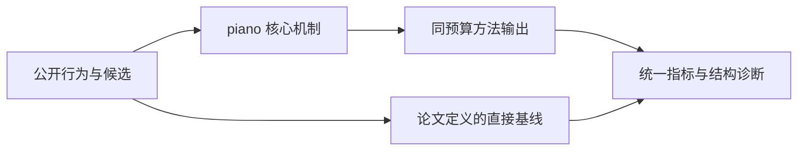
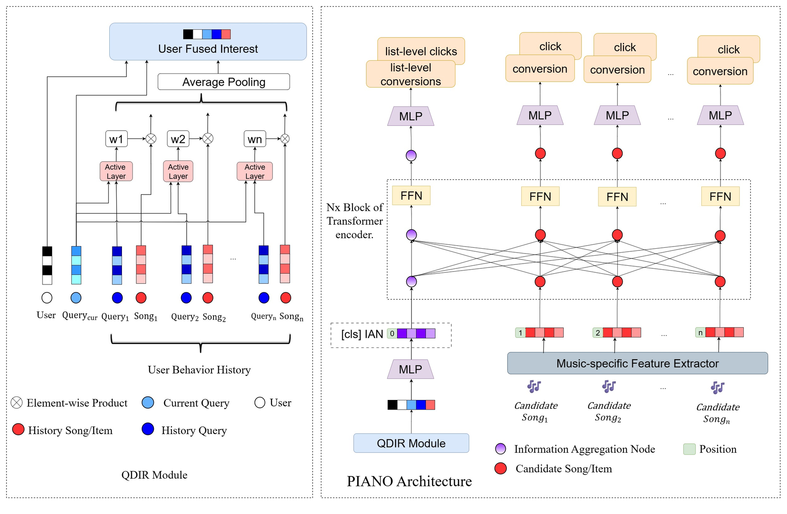

# PIANO：信息聚合节点驱动的个性化音乐重排

> **Fidelity: 核心机制复现**。本地代码执行论文最有辨识度、可由公开数据验证的机制；私有数据、生产模型与服务栈明确列为边界。

## 论文信息

| 项目 | 内容 |
| --- | --- |
| 论文链接 | [arXiv 2606.16641](https://arxiv.org/abs/2606.16641) |
| 公司/机构 | NetEase Cloud Music（按第一作者所属机构聚合） |
| 首次公开日期 | 2026-06-15（arXiv v1） |
| 原文开源代码 | 否：论文未提供官方/作者代码（核查日期：2026-09-02） |
| Adapter | `piano` |
| 本地复现代码 | [`src/auto_research/reproductions/piano/`](https://github.com/daiwk/auto-research/tree/main/src/auto_research/reproductions/piano/) |

## 原始论文总结

### 背景与主要改动

Query-Driven Interest Refiner 从历史中提取查询相关兴趣，Information Aggregation Node 汇总整张候选列表并反向条件化 item 级 CTR/CVR。



<!-- paper-figure:start -->
### 原论文关键图

[](https://arxiv.org/html/2606.16641v1/PIANO-Architecture-v3.jpg)

> **原论文 Figure 1（关键图）**：展示原论文提出的核心架构、主要模块及其连接关系。图片来自[原论文](https://arxiv.org/abs/2606.16641)，版权归原作者所有；点击图片可查看来源。
<!-- paper-figure:end -->

### 核心公式

$$
h_q=\\sum_t\\operatorname{softmax}(q^\\top h_t)h_t,\\quad z_{IAN}=\\operatorname{Attn}([v_1,\\ldots,v_n]).
$$

### 论文离线与线上效果

- 网易云音乐多周稳定分桶，多周 A/B：CTR +0.62%、CVR +4.45%；上线后覆盖 95% 流量。
- 上述数字只复述论文线上证据，不写入本地公开数据效果结论。

## 本地复现

> **本地对照口径**：同一全目录协议下，基线 NDCG@10 为 `0.05401`，实验组 PIANO 为 `0.04988`，相对变化 **-7.65%**。这是公开代理任务的负结果，生产线上 lift 的外推不适用。

三随机种子完整结果、均值、标准差与 95% CI：

- [`metrics/public-seeds42-44.json`](metrics/public-seeds42-44.json)

```bash
auto-research reproduce --paper piano --dataset-dir data --seed 42
```

## 复现边界

本地使用 MovieLens-1M 的公开子集及可审计代理目标，不能复现论文公司的私有日志、线上分桶、生产模型规模和 serving 栈。因此本页只解释为核心机制级验证，不宣称复现原文绝对指标或线上增益。
