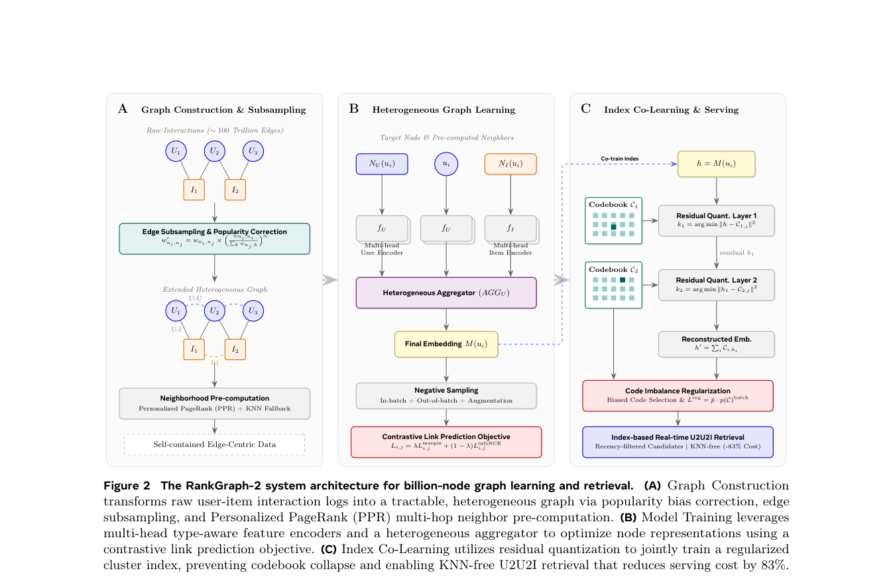

# RankGraph-2：可扩展工业图召回

> **复现保真度：核心机制复现。** 流行度校正、离线 PPR 和 cluster index 均实际执行。

## 论文信息

| 项目 | 内容 |
| --- | --- |
| 论文链接 | [arXiv 2606.18379](https://arxiv.org/abs/2606.18379) |
| 公司/机构 | Meta |
| 首次公开日期 | 2026-06-16（arXiv v1） |
| 原文开源代码 | 否：论文未提供官方/作者代码（核查日期：2026-07-28） |
| Adapter | `rankgraph2` |
| 本地复现代码 | [`src/auto_research/reproductions/rankgraph2/`](https://github.com/daiwk/auto-research/tree/main/src/auto_research/reproductions/rankgraph2/) |

## 原始论文总结

### 背景与主要改动

直接在线跑多层 GNN 成本高且易受热门边支配。RankGraph-2 对边做 popularity correction，离线预计算多跳 PPR，再用共同学习的 residual/cluster index 压缩服务。


<!-- paper-figure:start -->
### 原论文关键图

[](https://arxiv.org/pdf/2606.18379#page=5)

> **原论文 Figure 2（关键图）**：展示原论文提出的核心架构、主要模块及其连接关系。图片来自[原论文](https://arxiv.org/abs/2606.18379)，版权归原作者所有；点击图片可查看来源。
<!-- paper-figure:end -->

### 核心公式

$$
\pi_i=\alpha e_i+(1-\alpha)\pi_i\tilde P,\qquad
\tilde P_{uv}\propto P_{uv}/\sqrt{1+\operatorname{pop}(v)}.
$$

### 论文离线与线上效果

计算减少 83%，召回提升 3.8 倍/2.1 倍；线上 CTR +0.96%、CVR +2.75%，覆盖 20 多次生产发布。

## 本地复现

MovieLens item graph 上真实执行去偏转移、多跳 PPR 与 PPR 表征聚类索引。

> **本地对照口径**：基线为 one-hop retrieval，实验组为 debiased PPR + 两级 residual cluster index；NDCG@10 0.03540→0.07421，相对 +109.65%，见 `metrics/movielens-100k-seed42.json`。

```bash
auto-research reproduce --paper rankgraph2 --dataset-dir data --seed 42
```
