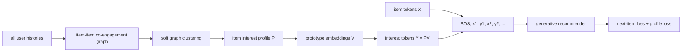

# G2Rec: Graph interest tokens for generative recommendation

> **Fidelity: 概念验证（非论文复现）**。当前 graph next-token scorer 代替了生成式 decoder 和 autoregressive interest-token training；旧指标不能验证 G2Rec。

- 论文：[arXiv 2606.20554](https://arxiv.org/abs/2606.20554)，Meta
- Adapter：`g2rec`；代码：`src/auto_research/reproductions/g2rec/`
- 本地数据：Amazon Beauty 5-core；运行：`auto-research reproduce --paper g2rec --seed 42`

## 原始论文总结

### 背景与主要改动

生成式推荐把 item 当 token，但纯 item 序列难以表达一个物品跨多个兴趣簇的语义，也难以利用分散在不同用户行为中的共现结构。G2Rec 从全站 co-engagement 构造 item-item 图，以可微 soft modularity 学习一个 item 对多个 interest prototype 的软归属，再把 item token 与其 interest-profile token 交替输入生成模型，并增加 profile prediction loss。

### 核心公式

令 $P\in\mathbb R^{|I|\times C}$ 为软归属、$k$ 为图度数、$|E|$ 为重复表示的边数，soft modularity 为

$$Q_{soft}(P)=\frac1{|E|}\sum_{(i,j)\in E}p_i^Tp_j-\gamma\frac{\|P^Tk\|_2^2}{|E|^2}.$$

prototype 和 interest token 为

$$v_a=\frac{\sum_i p_{i,a}x_i}{\sum_i p_{i,a}},\qquad y_i=\sum_a p_{i,a}v_a,$$

输入序列 $R_u=[BOS,x_{i_1},y_{i_1},\ldots,x_{i_N},y_{i_N}]$，联合目标为

$$\mathcal L^t=\underbrace{-\log F(i_{t+1}\mid R_{u,\le2t+1})}_{\mathcal L_{item}^t}
+\lambda\underbrace{\left[-\sum_a p_{i_t,a}\log F(a\mid R_{u,\le2t})\right]}_{\mathcal L_{profile}^t}.$$

### 论文离线与在线效果

论文在 Beauty、Sports、Toys、Yelp 上采用 5-core、leave-one-out 和 99 个采样负例，Llama 2 13B + LoRA 训练 3 epochs。G2Rec 在四个数据集的全部 6 个指标上排名第一：

| Dataset | 最强 baseline NDCG@5 | G2Rec | G2Rec NDCG@10 | MRR |
|---|---:|---:|---:|---:|
| Beauty | 0.2848 | 0.3035 | 0.3334 | 0.3034 |
| Sports | 0.2497 | 0.2869 | 0.3254 | 0.2867 |
| Toys | 0.2820 | 0.2931 | 0.3225 | 0.2942 |
| Yelp | 0.4252 | 0.4398 | 0.4927 | 0.4180 |

soft clustering 的 modularity 相对 Leiden 从 Beauty 0.419→0.499、Sports 0.365→0.452、Toys 0.437→0.550、Yelp 0.691→0.757。训练/推理每 batch 只增加 0.043s/0.0027s。Meta 线上 7 天与长期 A/B 报告 in-session **>+0.03%**，time spent、likes、shares 等 engagement **+0.06%–+0.19%**。

## 本地复现

自动下载论文同款 Amazon Beauty 5-core：198,502 条交互、22,363 用户、12,101 物品。使用 sketch spectral soft profile 避免构造 $12,101^2$ 稠密矩阵；validation 选择 interest-token 权重，测试严格使用 1 正例 + 99 随机负例。轻量 graph next-token scorer 替代 Llama 2 13B。

| Tokenization | Hit@10 | NDCG@10 | Head share@10 |
|---|---:|---:|---:|
| Item only | 0.2947 | 0.1795 | 0.1819 |
| Item + interest tokens | **0.3014** | **0.1808** | 0.2000 |

NDCG@10 **+0.72%**，方向与论文一致但幅度更小；head share 增加 1.81 个百分点，说明当前简化 scorer 仍需去偏约束。该结果是同源数据上的机制复现，不是 13B 生成模型复刻。
