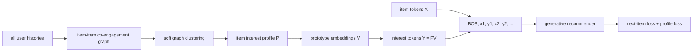

# G2Rec: Graph interest tokens for generative recommendation

> **Fidelity: 完整核心链路复现**。当前代码实际优化稀疏图 soft modularity，并训练交替 item/continuous-interest token 的自回归 Transformer、next-item loss 与 profile loss。

## 论文信息

| 项目 | 内容 |
| --- | --- |
| 论文链接 | [arXiv 2606.20554](https://arxiv.org/abs/2606.20554) |
| 公司/机构 | Meta |
| 首次公开日期 | 2026-06-18（arXiv v1） |
| 原文开源代码 | 否：论文未提供官方/作者代码（核查日期：2026-07-15） |
| Adapter | `g2rec` |
| 本地复现代码 | [`src/auto_research/reproductions/g2rec/`](https://github.com/daiwk/auto-research/tree/main/src/auto_research/reproductions/g2rec/) |

## 原始论文总结

### 背景与主要改动

生成式推荐把 item 当 token，但纯 item 序列难以表达一个物品跨多个兴趣簇的语义，也难以利用分散在不同用户行为中的共现结构。G2Rec 从全站 co-engagement 构造 item-item 图，以可微 soft modularity 学习一个 item 对多个 interest prototype 的软归属，再把 item token 与其 interest-profile token 交替输入生成模型，并增加 profile prediction loss。



### 核心公式

令 $P\in\mathbb R^{|I|\times C}$ 为软归属、$k$ 为图度数、$|E|$ 为重复表示的边数，soft modularity 为

$$
Q_{soft}(P)=\frac1{|E|}\sum_{(i,j)\in E}p_i^Tp_j-\gamma\frac{\|P^Tk\|_2^2}{|E|^2}.
$$

prototype 和 interest token 为

$$
v_a=\frac{\sum_i p_{i,a}x_i}{\sum_i p_{i,a}},\qquad y_i=\sum_a p_{i,a}v_a,
$$

输入序列 $R_u=[BOS,x_{i_1},y_{i_1},\ldots,x_{i_N},y_{i_N}]$，联合目标为

$$
\mathcal L^t=\underbrace{-\log F(i_{t+1}\mid R_{u,\le2t+1})}_{\mathcal L_{item}^t}
+\lambda\underbrace{\left[-\sum_a p_{i_t,a}\log F(a\mid R_{u,\le2t})\right]}_{\mathcal L_{profile}^t}.
$$

### 论文离线与线上效果

论文在 Beauty、Sports、Toys、Yelp 上采用 5-core、leave-one-out 和 99 个采样负例，Llama 2 13B + LoRA 训练 3 epochs。G2Rec 在四个数据集的全部 6 个指标上排名第一：

| Dataset | 最强 baseline NDCG@5 | G2Rec | G2Rec NDCG@10 | MRR |
|---|---:|---:|---:|---:|
| Beauty | 0.2848 | 0.3035 | 0.3334 | 0.3034 |
| Sports | 0.2497 | 0.2869 | 0.3254 | 0.2867 |
| Toys | 0.2820 | 0.2931 | 0.3225 | 0.2942 |
| Yelp | 0.4252 | 0.4398 | 0.4927 | 0.4180 |

soft clustering 的 modularity 相对 Leiden 从 Beauty 0.419→0.499、Sports 0.365→0.452、Toys 0.437→0.550、Yelp 0.691→0.757。训练/推理每 batch 只增加 0.043s/0.0027s。Meta 线上 7 天与长期 A/B 报告 in-session **>+0.03%**，time spent、likes、shares 等 engagement **+0.06%–+0.19%**。

## 本地复现

> **本地对照口径**：基线是参数级别匹配的 Item-only Autoregressive Decoder；实验组是 G2Rec Item+Interest Decoder；NDCG@10 从 0.0474 升至 0.0530（**+11.92%**）。这是 interest-token 组织与辅助目标的联合消融，不是相对 DIN。

自动下载论文同款 Amazon Beauty 5-core：22,363 用户、12,101 物品。三步窗口构造出 265,133 条稀疏 co-engagement edge，直接优化 12 个 soft interest cluster 的 modularity；随后在同一参数级别比较 item-only decoder 与交替 item/interest token decoder。两者均为 96d、2-layer causal Transformer，训练 240 step；G2Rec 额外使用权重 `0.1` 的 profile prediction loss。测试固定抽取 1,000 用户，每人 1 正例 + 99 随机负例。

| Tokenization | Hit@10 | NDCG@10 | Head share@10 |
|---|---:|---:|---:|
| Item-only autoregressive decoder | 0.1100 | 0.0474 | **0.1107** |
| G2Rec item + interest decoder | **0.1130** | **0.0530** | 0.1177 |

soft modularity 达 `0.3286`；G2Rec final training loss `9.8684`，item-only 为 `11.2813`。NDCG@10 相对提升 **11.92%**，Hit@10 提升 0.3 个百分点，但 head share 同时增加 0.7 个百分点。这验证了本地缩放版的核心训练链路，但收益中可能包含更偏头部的影响，且不能外推 Meta 线上幅度；96d decoder 替代了论文 Llama-2-13B。

结构化指标见 [`metrics/beauty-seed42.json`](metrics/beauty-seed42.json)。完整运行：

```bash
pip install -e '.[neural-recs]'
auto-research reproduce --paper g2rec --dataset-dir data --seed 42
```

下载数据和原始运行目录只保存在被 Git 忽略的 `data/`、`runs/`；MR 只提交代码、测试、文档与脱敏指标。
