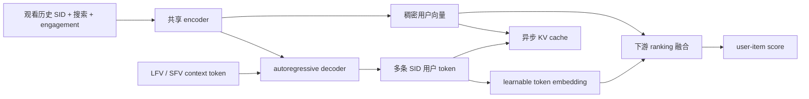
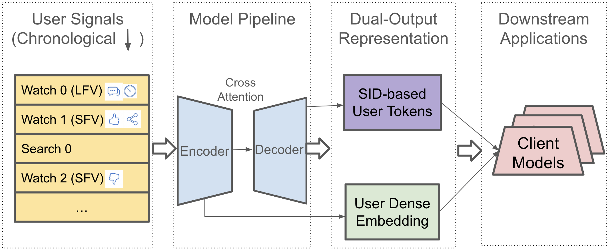

# TokenMinds：面向大规模推荐的离散用户 Token 与稠密用户向量

> **Fidelity: 核心机制复现**。本地实际训练共享序列编码器、稠密用户向量、分层 SID 用户 token 预测头及下游融合排序；Google 的 Gemini MoE、YouTube 私有数据和异步生产服务不在本地冒充复刻。

## 论文信息

| 项目 | 内容 |
| --- | --- |
| 论文链接 | [arXiv 2606.25147](https://arxiv.org/abs/2606.25147) |
| 公司/机构 | Google DeepMind / YouTube |
| 首次公开日期 | 2026-06-23（arXiv v1） |
| 原文开源代码 | 否：论文未提供官方/作者代码（核查日期：2026-08-09） |
| Adapter | `tokenminds` |
| 本地复现代码 | [`src/auto_research/reproductions/tokenminds/`](https://github.com/daiwk/auto-research/tree/main/src/auto_research/reproductions/tokenminds/) |

## 原始论文总结

### 背景与主要改动

传统工业用户建模把完整兴趣压入少量稠密向量，容易损失细粒度、多峰兴趣；直接让 LLM 输出文本画像又难以与非文本 item ID 和下游排序模型对齐。TokenMinds 将 PLUM 的 item Semantic ID（SID）体系扩展到用户侧：encoder 读取视频 SID、观看特征和搜索文本并输出稠密用户向量，decoder 则自回归生成若干代表未来兴趣的 SID 用户 token。下游同时使用两种表示，从而保留现有 dense feature 兼容性并引入离散、可落到内容语义空间的兴趣表示。

训练时，模型从未来 24 小时窗口随机抽取多个目标，而不是只预测紧邻的下一次观看；多目标、look-ahead sampling 和 SID 前缀截断共同避免短期过拟合。跨 LFV/SFV 场景时，每次行为带场景 token，共享一次 encoder prefill 后通过 multi-context decoding 并行生成场景专属用户 token。生产侧将重模型异步执行并缓存表示，实时排序只读取缓存。



<!-- paper-figure:start -->
### 原论文关键图

[](https://arxiv.org/html/2606.25147v1/figures/framework.png)

> **原论文 Figure 1**：TokenMinds 总体架构。encoder 同时承载稠密表示路径，decoder 生成 SID 用户 token，两种表示一同供下游模型使用。图片来自[原论文](https://arxiv.org/abs/2606.25147)，版权归原作者所有。
<!-- paper-figure:end -->

### 核心公式

设截止时间前的历史为 $W_{1:t}$，从未来 24 小时窗口抽取 $N$ 个目标，每个目标只预测长度为 $L$ 的粗粒度 SID 前缀。论文的用户 token 生成目标为：

$$
\mathcal L=-\sum_{i=1}^{N}r(W_i)\sum_{j=1}^{L}
\log P\!\left(\operatorname{SID}_{i,j}\mid W_{1:t},W_{<i},
\operatorname{SID}_{i,<j}\right).
$$

$r(W_i)$ 汇总观看质量等 engagement 信号；论文实际更倾向按 reward 比例采样样本，再对样本等权训练。encoder 通过 decoder cross-attention 接收梯度，最终输出 pooled dense embedding；decoder beam 产生的 SID 前缀经 learnable embedding 后与 dense embedding 一同进入下游排序。

### 论文离线与线上效果

- 离线 Table 1：完整模型 Session Recall@10 为 `0.291`、Cold-Start Recall@10 为 `0.210`；去掉多目标、look-ahead 或 SID 截断都会下降，去掉 SID 截断时分别相对下降 `15.1%` 与 `17.1%`。
- 离线 Table 2：CPT 初始化并加入搜索文本，相对随机初始化且无搜索的 Session / Cold-Start Recall@10 分别提升 `23.5%` / `31.5%`。
- 线上 Table 4：SFV 的 Embed+Token 令 Engaged Users `+0.11%`、Satisfied Engagement `+0.62%`；LFV 对应为 `+0.02%` / `+0.08%`。实验持续七天，粗体结果通过 95% 显著性检验。
- 跨场景 Table 6：合并 LFV/SFV 后训练 compute `-50%`、上游 serving compute `-31%`，Fresh Engagement 在 SFV/LFV 分别 `+0.33%` / `+0.19%`。
- 系统已在多个 YouTube 主 surface 面向数十亿用户全流量部署。因此它同时满足“量化线上 A/B”和“明确全流量”的最高优先级门槛。

## 本地复现

> **本地对照口径**：基线是同数据、同 seed、同 120 steps 的 dense-only GRU 用户编码器；实验组增加实际训练的两层 SID 用户 token 预测、learnable token embedding 与 gated residual 融合。单 seed NDCG@10 相对基线为 **`-0.35%`**，不宣称稳定提升。

MovieLens-1M 固定 320 users / 480 items、32-event 历史、全目录排序。genre 内容向量经两级 residual quantization 形成公开数据 SID。基线 Hit@10 / NDCG@10 为 `0.03438 / 0.02027`，TokenMinds 为 `0.03438 / 0.02020`；实验组 head share 从 `0.1050` 降至 `0.1034`。这个结果说明小数据、短序列和未做 PLUM CPT 时，SID 辅助任务尚未带来稳定质量收益；它不是对论文生产结论的否定。

稳定指标见 [`metrics/movielens-1m-seed42.json`](metrics/movielens-1m-seed42.json)。

```bash
auto-research reproduce --paper tokenminds --dataset-dir data --seed 42
```

## 复现边界

本地训练了论文中心的 dual-output 路径，而不是只把配置命名为 TokenMinds。MovieLens genre 取代 YouTube 多模态内容，320 users / 480 items 与 32 条历史取代数十亿用户、1,200 watches 和搜索序列；小型 GRU encoder 加 SID heads 取代 Gemini 370M MoE encoder + 370M decoder；没有复刻 PLUM CPT、15-target look-ahead 数据构造、40-beam multi-context decoding、24 小时异步刷新、1.44M reads/s KV 服务或生产 ranking client。
