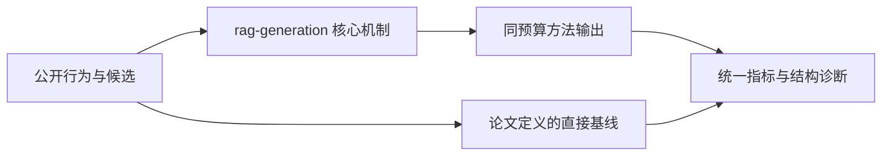
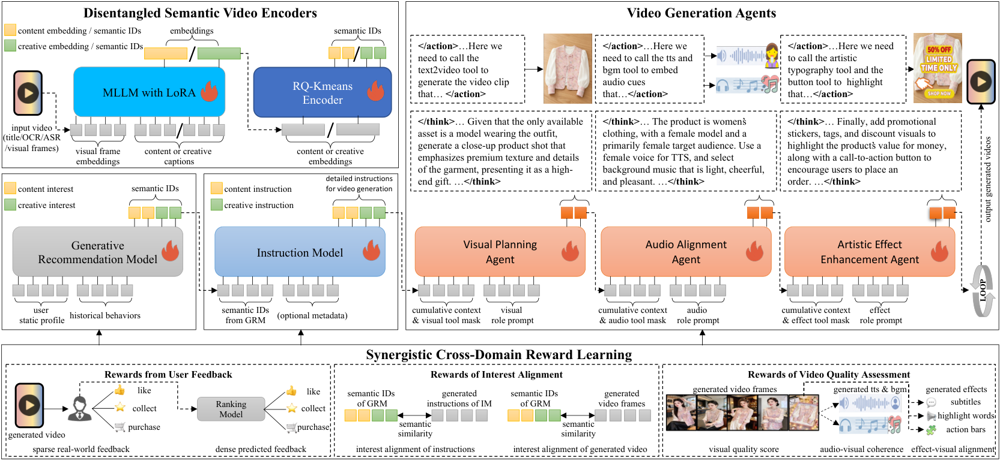

# Recommendation as Generation：推荐即生成

> **Fidelity: 核心机制复现**。本地代码执行论文最有辨识度、可由公开数据验证的机制；私有数据、生产模型与服务栈明确列为边界。

## 论文信息

| 项目 | 内容 |
| --- | --- |
| 论文链接 | [arXiv 2606.25496](https://arxiv.org/abs/2606.25496) |
| 公司/机构 | Kuaishou / Beihang University（按第一作者所属机构聚合） |
| 首次公开日期 | 2026-06-24（arXiv v1） |
| 原文开源代码 | 否：论文未提供官方/作者代码（核查日期：2026-09-02） |
| Adapter | `rag-generation` |
| 本地复现代码 | [`src/auto_research/reproductions/rag_generation/`](https://github.com/daiwk/auto-research/tree/main/src/auto_research/reproductions/rag_generation/) |

## 原始论文总结

### 背景与主要改动

用解耦语义 ID 连接生成式推荐与兴趣条件视频生成，并以跨域 reward 协调候选选择和内容创建。



<!-- paper-figure:start -->
### 原论文关键图

[](https://arxiv.org/html/2606.25496v1/framework.png)

> **原论文 Figure 2（关键图）**：展示原论文的整体流程、关键阶段及其数据流向。图片来自[原论文](https://arxiv.org/abs/2606.25496)，版权归原作者所有；点击图片可查看来源。
<!-- paper-figure:end -->

### 核心公式

$$
z_i=(z_i^{content},z_i^{creative}),\\qquad v\\sim p_\\theta(v|z_{interest}).
$$

### 论文离线与线上效果

- 快手广告生产 A/B，相对强 GRM 广告收入 +1.870%，相对 DLRM +5.462%。
- 上述数字只复述论文线上证据，不写入本地公开数据效果结论。

## 本地复现

> **本地对照口径**：同一全目录协议下，基线 NDCG@10 为 `0.05401`，实验组 RaG 为 `0.04235`，相对变化 **-21.59%**。仅验证 D-SID 接口，视频生成器未复刻；生产线上 lift 的外推不适用。

三随机种子完整结果、均值、标准差与 95% CI：

- [`metrics/public-seeds42-44.json`](metrics/public-seeds42-44.json)

```bash
auto-research reproduce --paper rag-generation --dataset-dir data --seed 42
```

## 复现边界

本地使用 MovieLens-1M 的公开子集及可审计代理目标，不能复现论文公司的私有日志、线上分桶、生产模型规模和 serving 栈。因此本页只解释为核心机制级验证，不宣称复现原文绝对指标或线上增益。
