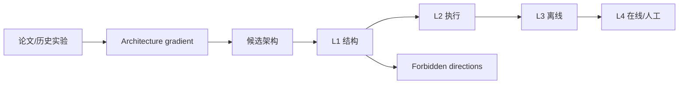

# NOVA：面向工业推荐架构进化的可验证 Agent Harness

> **复现保真度：核心机制复现。** 四级验证、失败方向记忆和 architecture gradient 均实际执行；腾讯生产 agent 与线上灰度未复刻。

## 论文信息

| 项目 | 内容 |
| --- | --- |
| 论文链接 | [arXiv 2606.27243](https://arxiv.org/abs/2606.27243) |
| 公司/机构 | Tencent |
| 首次公开日期 | 2026-06-25（arXiv v1） |
| 原文开源代码 | 否：论文未提供官方/作者代码（核查日期：2026-07-28） |
| Adapter | `nova` |
| 本地复现代码 | [`src/auto_research/reproductions/nova/`](https://github.com/daiwk/auto-research/tree/main/src/auto_research/reproductions/nova/) |

## 原始论文总结

### 背景与主要改动

普通代码 agent 只能证明代码“能跑”，无法阻止结构语义错误和静默负向。NOVA 用 architecture gradient 汇总历史修改、验证诊断和指标反馈，再通过 L1 结构语义、L2 可执行、L3 离线有效、L4 在线影响的级联验证逐级放行，高风险任务交给人工。



### 核心公式

$$
g_t=\operatorname{Aggregate}(\Delta a_{<t},d_{<t},m_{<t},\mathcal M_t),
\qquad a_{t+1}=\operatorname{AgentUpdate}(a_t,g_t).
$$

### 论文离线与线上效果

L2/L3 有效通过率分别为 54.5%/60.0%，一次文献到生产任务的人力时间缩短超过 13 倍。线上三个 pCVR 目标 GMV 分别 +1.25%、+1.70%、+2.02%，pCVR bias 分别降低 58.8%、66.7%、37.3%。

## 本地复现

在 MovieLens 100K 上生成 transition、content、popularity 和故意错误的 shape 候选，真实执行四级验证并只用 validation 选候选；通用 evolve 还会把验证记录、成功技能和禁止方向写入 `result.json`。

> **本地对照口径**：基线为固定启发式 ensemble，实验组为经过验证级联选择的 specialist；NDCG@10 0.03540→0.07119，相对 +101.13%，见 `metrics/movielens-100k-seed42.json`。

```bash
auto-research reproduce --paper nova --dataset-dir data --seed 42
```
