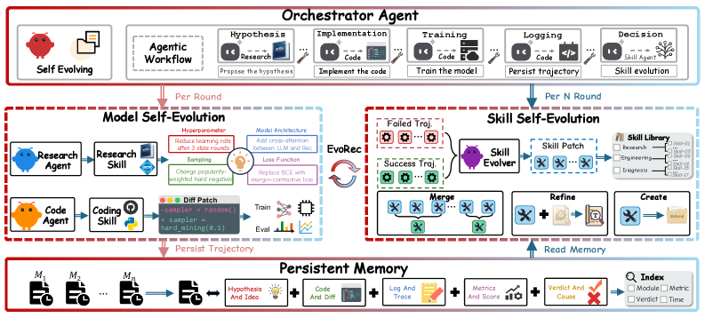

# EvoRec：自进化 Agent 推荐系统

> **复现保真度：核心机制复现。** 模型候选与优化方法双轨迭代、跨代 skill memory 均实际执行；生产多 agent 工具链未复刻。

## 论文信息

| 项目 | 内容 |
| --- | --- |
| 论文链接 | [arXiv 2606.28368](https://arxiv.org/abs/2606.28368) |
| 公司/机构 | Alibaba International Digital Commerce Group |
| 首次公开日期 | 2026-06-15（arXiv v1） |
| 原文开源代码 | 否：论文未提供官方/作者代码（核查日期：2026-08-09） |
| Adapter | `evorec` |
| 本地复现代码 | [`src/auto_research/reproductions/evorec/`](https://github.com/daiwk/auto-research/tree/main/src/auto_research/reproductions/evorec/) |

## 原始论文总结

### 背景与主要改动

既有 LLM agent 每轮只翻译代码，不会积累优化方法。EvoRec 让 Research/Code Agent 迭代模型，Skill Evolver 从持久 Memory 中提炼可复用方法，使“模型”和“怎么优化模型”同时进化。


<!-- paper-figure:start -->
### 原论文关键图

[](https://arxiv.org/html/2606.28368v1/x1.png)

> **原论文 Figure 1（关键图）**：展示原论文方法的总体设计和关键组成。图片来自[原论文](https://arxiv.org/abs/2606.28368)，版权归原作者所有；点击图片可查看来源。
<!-- paper-figure:end -->

### 核心公式

$$
\theta_{t+1}=\operatorname{Optimize}(\theta_t,s_t),\qquad
s_{t+1}=\operatorname{Distill}(\mathcal M_t,\Delta \operatorname{metric}_t).
$$

### 论文离线与线上效果

相对最强基线离线最高 +5.54%；线上 A/B revenue +1.85%、CTR +1.02%。

## 本地复现

本地让 transition、content、popularity 三类技能竞争，连续三代根据固定 validation 选择并把胜出技能写入 memory；该记忆还接入通用 evolve 的下一代候选排序。

> **本地对照口径**：基线为固定 ensemble，实验组为三代 skill-memory 进化结果；NDCG@10 0.03540→0.04650，相对 +31.36%，见 `metrics/movielens-100k-seed42.json`。

```bash
auto-research reproduce --paper evorec --dataset-dir data --seed 42
```
