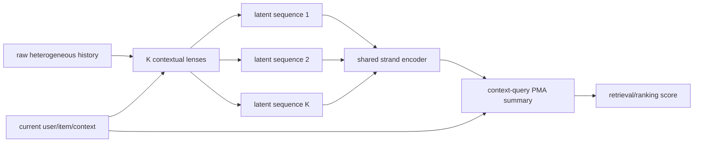

# CMSL: Constructive Multi-Sequence Learning

> **Fidelity: 概念验证（非论文复现）**。当前固定 genre strand 省略 learned contextual lenses 与 trainable HSTU backbone；旧指标不能验证 CMSL。

- 论文：[arXiv 2606.28533](https://arxiv.org/abs/2606.28533)，Meta
- Adapter：`cmsl`；代码：`src/auto_research/reproductions/cmsl/`
- 本地数据：MovieLens-100K；运行：`auto-research reproduce --paper cmsl --seed 42`

## 原始论文总结

### 背景与主要改动

把点击、观看、互动等所有行为塞进单一长序列会混合多个意图，且 self-attention 成本随长度快速增长。CMSL 不依赖预定义业务 taxonomy，而是利用当前上下文特征学习多个 contextual lens，把原始历史动态构造成 K 条 latent semantic sequence；每条 strand 独立编码，再用当前非序列上下文作为 query 做 PMA 聚合。论文还给出 degree-2 polynomial feature map 的线性 HSTU 近似，以支持工业长序列。

### 核心公式

每个事件 $x_t$ 对 K 个 lens 得到软分配，可写成

$$
a_{t,k}=\operatorname{softmax}_k(g_k(x_t,c)),\qquad S_k=\{a_{t,k}x_t\}_{t=1}^{T}.
$$

线性 HSTU 用二阶 feature map 将注意力核分解：

$$
SiLU(QK^T)V\approx\phi(Q)\phi(K)^TV+AV,
$$

其中 $\phi(x)$ 包含一阶项 $x_i$ 和二阶项 $x_ix_j$。各 strand 表示 $H_k$ 再由 contextual query $q(c)$ 聚合：

$$
z=\sum_k\operatorname{softmax}_k(q(c)^TW_KH_k)\,W_VH_k.
$$

### 论文离线与线上效果

论文在 Meta 内部 retrieval/ranking 数据上报告归一化熵改善：

| Surface | Offline metric | CMSL change |
|---|---|---:|
| 1 | Eval comment NE | -0.62% |
| 1 | Eval like NE | -0.33% |
| 2 | Eval CTR / CVR NE | -0.12% / -0.10% |
| 3 | Eval CTR / CVR NE | -0.09% / -0.06% |
| 4 | Eval CTR / CVR NE | -0.10% / -0.13% |

Surface 5 的线上 A/B 四个 engagement 指标分别 **+0.116%、+0.158%、+0.171%、+0.092%**。论文没有公开可下载的原始训练数据。

## 本地复现

> **本地对照口径**：基线是 Single Sequence scorer；实验组是 CMSL 多 strand 聚合；NDCG@10 从 0.0351 升至 0.0355（**+0.95%**），小于 seed 波动。这是多序列结构的概念代理消融，不是相对 DIN。

MovieLens genre 初始化 6 个 semantic strand，实现 strand 独立建模、二阶线性注意力近似和候选感知聚合。评分 ≥4、leave-two-out、full catalog、三个 seed；融合权重仅由 validation 选择。

| Model | Hit@10 | NDCG@10 |
|---|---:|---:|
| Single sequence | 0.0726 ± 0.0013 | 0.0351 ± 0.0014 |
| CMSL | 0.0726 ± 0.0027 | **0.0355 ± 0.0016** |

平均 NDCG@10 **+0.95%**，但小于 seed 波动，只能判断方向正向、证据不足。公开 proxy 不等价于可学习 lens、生产 HSTU kernel 或 Meta 内部特征。诊断指标见 [`metrics/movielens-100k-seeds42-44.json`](metrics/movielens-100k-seeds42-44.json)。
