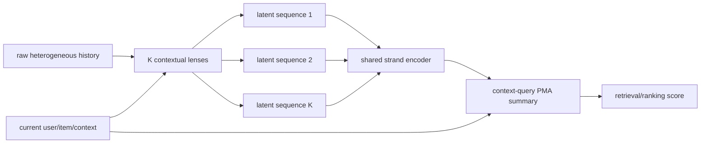
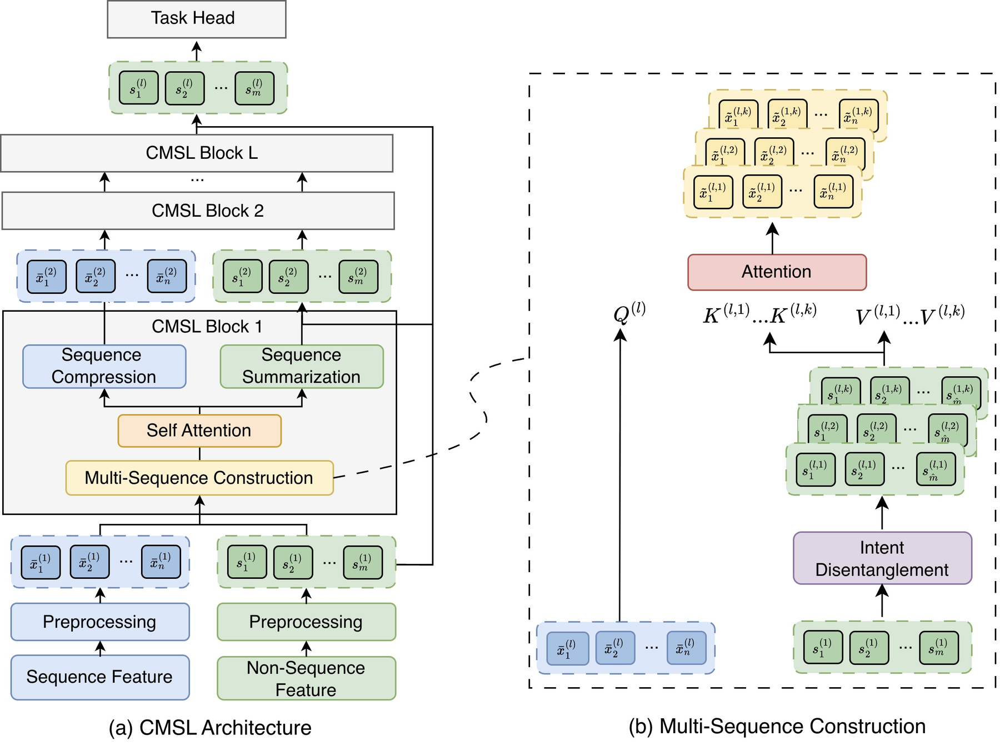

# CMSL: Constructive Multi-Sequence Learning

> **Fidelity: 核心机制复现**。当前实现让 contextual lenses、软序列构造和 HSTU-style gated attention 一起反向传播；未复刻 Meta 私有特征、规模和分布式 serving。

## 论文信息

| 项目 | 内容 |
| --- | --- |
| 论文链接 | [arXiv 2606.28533](https://arxiv.org/abs/2606.28533) |
| 公司/机构 | Meta |
| 首次公开日期 | 2026-06-26（arXiv v1） |
| 原文开源代码 | 否：论文未提供官方/作者代码（核查日期：2026-08-09） |
| Adapter | `cmsl` |
| 本地复现代码 | [`src/auto_research/reproductions/cmsl/`](https://github.com/daiwk/auto-research/tree/main/src/auto_research/reproductions/cmsl/) |

## 原始论文总结

### 背景与主要改动

把点击、观看、互动等所有行为塞进单一长序列会混合多个意图，且 self-attention 成本随长度快速增长。CMSL 不依赖预定义业务 taxonomy，而是利用当前上下文特征学习多个 contextual lens，把原始历史动态构造成 K 条 latent semantic sequence；每条 strand 独立编码，再用当前非序列上下文作为 query 做 PMA 聚合。论文还给出 degree-2 polynomial feature map 的线性 HSTU 近似，以支持工业长序列。

```mermaid
flowchart LR
  A["raw heterogeneous history"] --> B["K contextual lenses"]
  C["current user/item/context"] --> B
  B --> D1["latent sequence 1"]
  B --> D2["latent sequence 2"]
  B --> D3["latent sequence K"]
  D1 --> E["shared strand encoder"]
  D2 --> E
  D3 --> E
  E --> F["context-query PMA summary"]
  C --> F
  F --> G["retrieval/ranking score"]
```

<!-- paper-figure:start -->
### 原论文关键图

> **原论文 Figure 2（关键图）**：展示原论文提出的核心架构、主要模块及其连接关系。图片来自[原论文](https://arxiv.org/abs/2606.28533)，版权归原作者所有；点击图片可查看来源。
<!-- paper-figure:end -->

### 核心公式

每个事件 $x_t$ 对 K 个 lens 得到软分配，可写成

$$
a_{t,k}=\operatorname{softmax}_k(g_k(x_t,c)),\qquad S_k=\{a_{t,k}x_t\}_{t=1}^{T}.
$$

线性 HSTU 用二阶 feature map 将注意力核分解：

$$
SiLU(QK^T)V\approx\phi(Q)\phi(K)^TV+AV,
$$

其中 $\phi(x)$ 包含一阶项 $x_i$ 和二阶项 $x_ix_j$。各 strand 表示 $H_k$ 再由 contextual query $q(c)$ 聚合：

$$
z=\sum_k\operatorname{softmax}_k(q(c)^TW_KH_k)\,W_VH_k.
$$

### 论文离线与线上效果

论文在 Meta 内部 retrieval/ranking 数据上报告归一化熵改善：

| Surface | Offline metric | CMSL change |
|---|---|---:|
| 1 | Eval comment NE | -0.62% |
| 1 | Eval like NE | -0.33% |
| 2 | Eval CTR / CVR NE | -0.12% / -0.10% |
| 3 | Eval CTR / CVR NE | -0.09% / -0.06% |
| 4 | Eval CTR / CVR NE | -0.10% / -0.13% |

Surface 5 的线上 A/B 四个 engagement 指标分别 **+0.116%、+0.158%、+0.171%、+0.092%**。论文没有公开可下载的原始训练数据。

## 本地复现

> **本地对照口径**：基线与实验组共享 embedding、HSTU block、优化器和训练预算；实验组仅增加 6 个 learned contextual lenses 和多 strand 聚合，NDCG@10 **+29.42%**，不是相对 DIN。

MovieLens 全量正反馈序列上，事件表征对 6 个 lens 做可微软分配，形成多条 latent sequence profile；HSTU-style SiLU attention 与 U-gate 实际训练。评分 ≥4、leave-two-out、full catalog、三个 seed，test 不参与选型。

| Model | Hit@10 | NDCG@10 |
|---|---:|---:|
| Single-sequence HSTU | 0.0046 ± 0.0005 | 0.0021 ± 0.0004 |
| CMSL learned lenses | **0.0061 ± 0.0010** | **0.0028 ± 0.0003** |

平均 NDCG@10 **+29.42%**，但绝对指标仍低，说明在相同的小训练预算下 learned lenses 优于单序列结构，不能等同于 Meta 线上增益。公开实现没有生产 HSTU kernel 或 Meta 内部特征。稳定指标见 [`metrics/movielens-100k-seeds42-44.json`](metrics/movielens-100k-seeds42-44.json)。
