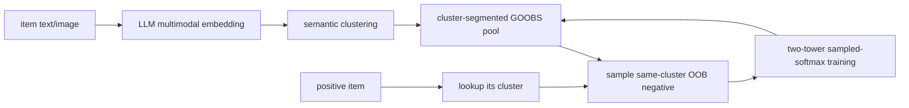

# Cluster GOOBS: LLM-clustered hard negatives

> **Fidelity: 核心机制复现**。cluster-conditioned online hard-negative sampler 实际执行；MovieLens genre 替换私有 LLM 多模态 cluster，分布式 GOOBS serving 未复刻。

- 论文：[arXiv 2607.00448](https://arxiv.org/abs/2607.00448)，Meta
- Adapter：`cluster-goobs`；代码：`src/auto_research/reproductions/cluster_goobs/`
- 本地数据：MovieLens-1M；运行：`auto-research reproduce --paper cluster-goobs --seed 42`

## 原始论文总结

### 背景与主要改动

大规模双塔召回常从 out-of-batch（OOB）池随机抽负例。绝大多数负例过于容易，梯度弱；同时热门物品更常进入池，形成曝光反馈循环。论文先用 LLM/多模态 embedding 把物品划入语义 cluster，再让 GOOBS 的 update engine 按 cluster 分段写入实时 OOB 池，sample engine 大概率从正例所在 cluster 抽 hard negative。这样不增加在线模型结构，采样仍是 O(1)。

### 核心公式

双塔相似度 $s(x_i,y_j)=v_i^Tu_j$，batch/OOB sampled softmax 为

$$P(y_i\mid x_i;\theta)=\frac{\exp s(x_i,y_i)}{\sum_{j\in\mathcal C_i}\exp s(x_i,y_j)}.$$

Cluster GOOBS 将候选集合改为混合分布

$$q^-(j\mid i)=\rho\,q_{random}(j)+(1-\rho)q_{cluster}(j\mid c(i)),$$

MovieLens-1M 设置 random:cluster 为 1:15，Amazon 为 1:31。核心变化在采样分布和实时分段池，不在双塔 loss 本身。

### 论文离线与线上效果

| Dataset | HR@50 Random | Cluster | 相对提升 | HR@100 Random | Cluster | 相对提升 |
|---|---:|---:|---:|---:|---:|---:|
| MovieLens-1M | 0.2253 | 0.2415 | +7.2% | 0.3588 | 0.3682 | +2.7% |
| Amazon Grocery | 0.0254 | 0.0301 | +18.5% | 0.0406 | 0.0470 | +15.7% |
| Amazon Electronics | 0.0084 | 0.0131 | +55.6% | 0.0154 | 0.0201 | +30.2% |
| Amazon Home | 0.0050 | 0.0074 | +47.3% | 0.0082 | 0.0118 | +42.3% |

线上 A/B 为 3% control/3% test、约 1,800 万物品：CTR **+53%**，训练 QPS -1.4%，推理无回归；top-100 物品曝光贡献从 50% 降到 32%，千次以上曝光物品 cohort CTR +50%。

## 本地复现

> **本地对照口径**：基线是 Random OOB negative sampler；实验组是 Cluster GOOBS sampler；NDCG@10 **+0.98%**、head share **-1.81%**。这是负采样策略消融，不是完整双塔相对 DIN 的比较。

本轮已从 MovieLens-100K 升级为论文原始公开数据 MovieLens-1M：1,000,209 条评分、6,040 用户、3,706 物品；按论文公开设置将 3–5 分视为正反馈、genre 作为公开 cluster、random:cluster=1:15。为适配 Mac，每 seed 固定抽 100,000 个训练转移、3 epochs，共三个 seed；评估仍为 full-catalog Hit/NDCG@10，不冒充论文 HR@50/100。

| Sampler | Hit@10 | NDCG@10 | Head share@10 |
|---|---:|---:|---:|
| Random OOB | 0.0377 ± 0.0015 | 0.0190 ± 0.0006 | 0.9435 ± 0.0027 |
| Cluster GOOBS | **0.0381 ± 0.0010** | **0.0191 ± 0.0006** | **0.9265 ± 0.0041** |

NDCG@10 **+0.98%**，head share **-1.81%**，同时复现了精度小幅上升与热门集中度下降的方向。差距主要来自 genre cluster 远弱于论文约 300 个 LLM 多模态 cluster，以及训练转移上限和轻量双塔。结构化指标见 [`metrics/movielens-1m-seeds42-44.json`](metrics/movielens-1m-seeds42-44.json)。
