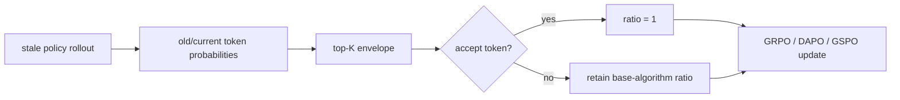

# SIS: Turning Off-Policy Tokens On-Policy

> **Fidelity: 核心机制复现**。SIS 的 off-policy token 变换按论文公式实际执行；Qwen3 上的完整 RL 后训练不在本地实验中。

## 论文信息

| 项目 | 内容 |
| --- | --- |
| 论文链接 | [arXiv 2607.04728](https://arxiv.org/abs/2607.04728) |
| 公司/机构 | 论文作者团队（原文未标注公司） |
| 首次公开日期 | 2026-07-06（arXiv v1） |
| 原文开源代码 | 否：论文未提供官方/作者代码（核查日期：2026-07-22） |
| Adapter | `sis` |
| 本地复现代码 | [`src/auto_research/reproductions/sis/`](https://github.com/daiwk/auto-research/tree/main/src/auto_research/reproductions/sis/) |

## 原始论文总结

### 背景与主要改动

异步 rollout、样本复用和 stale policy 会让 LLM 强化学习变成 off-policy 更新。标准 importance sampling（IS）在长序列上连乘后方差很大，直接 clipping 又会丢失有效梯度。SIS 将 token 级 rejection sampling 插入 GRPO、DAPO、GSPO：被接受的旧策略 token 可视为来自当前策略，其 IS ratio 直接置 1；未接受 token 仍交给原算法处理。论文还用 behavior policy 的 top-K token 近似拒绝采样 envelope，使额外开销很小。

### 核心公式

标准 token ratio 与序列 ratio 为

$$
w_t(\theta)=\frac{\pi_\theta(y_t\mid x,y_{<t})}{\pi_{\mathrm{old}}(y_t\mid x,y_{<t})},\qquad w(\theta)=\prod_{t=1}^{T}w_t(\theta).
$$

精确 rejection envelope 为 $M_t=\max_v\pi_\theta(v)/\pi_{\mathrm{old}}(v)$；工程实现只在 behavior policy 的 top-K 集合 $V_K$ 上计算 $\hat M_t$。若接受标记为 $z_t$，SIS 使用

$$
\widetilde w_t=\begin{cases}1,&z_t=1\\g(w_t),&z_t=0,\end{cases}
$$

其中 $g$ 可对应 GRPO clipping、DAPO asymmetric clipping 或 GSPO sequence correction。论文用累计 log 偏差 $D=\sum_t|\log w_t|$ 证明 SIS 收紧 off-policy 近似误差。

### 论文离线与线上效果

论文在 Qwen3-8B/14B dense 与 Qwen3-30B-A3B MoE 上训练，覆盖 DAPO-Math-17K、NQ+HotpotQA，以及 10 个数学/agent benchmark。主要结果：

| Backbone / algorithm | Math Avg | +SIS | 绝对提升 | Agent Avg | +SIS | 绝对提升 |
|---|---:|---:|---:|---:|---:|---:|
| Qwen3-8B / GRPO | 49.05 | 52.59 | +3.54 | 45.85 | 47.83 | +1.98 |
| Qwen3-8B / DAPO | 51.24 | 55.14 | +3.90 | 44.59 | 47.64 | +3.05 |
| Qwen3-30B-A3B / GRPO；agent 为 Qwen3-14B | 51.29 | 57.66 | +6.37 | 48.03 | 49.60 | +1.57 |

这是训练算法论文，没有推荐系统线上 A/B；原文未报告线上效果。

## 本地复现

> **本地对照口径**：基线是标准 token-level Importance Sampling；实验组是 SIS ratio transformation；importance-weight variance 平均 **-6.62%**。这是 off-policy estimator 比较，DIN 与推荐排序指标均不适用。

实现 Algorithm 1 与 ratio 转换机制。字符 bigram 的前 45% 拟合 stale behavior policy、随后 35% 拟合 current policy；每个 seed 采样 50,000 token，top-K=10，baseline 为标准 token IS。

| Seed | weight variance 降幅 | SIS accept rate |
|---:|---:|---:|
| 41 | 14.56% | 68.67% |
| 42 | 4.78% | 68.65% |
| 43 | 0.53% | 68.81% |
| Mean | **6.62%** | **68.71%** |

三个 seed 都降低方差，验证了核心机制。Tiny Shakespeare 仅是低成本 distribution-shift proxy；Qwen3、GRPO/DAPO/GSPO 完整训练所需模型与算力不适合本地 Mac，因此没有把该结果宣称为论文 benchmark 复刻。结构化指标见 [`metrics/tiny-shakespeare-seeds41-43.json`](metrics/tiny-shakespeare-seeds41-43.json)。
